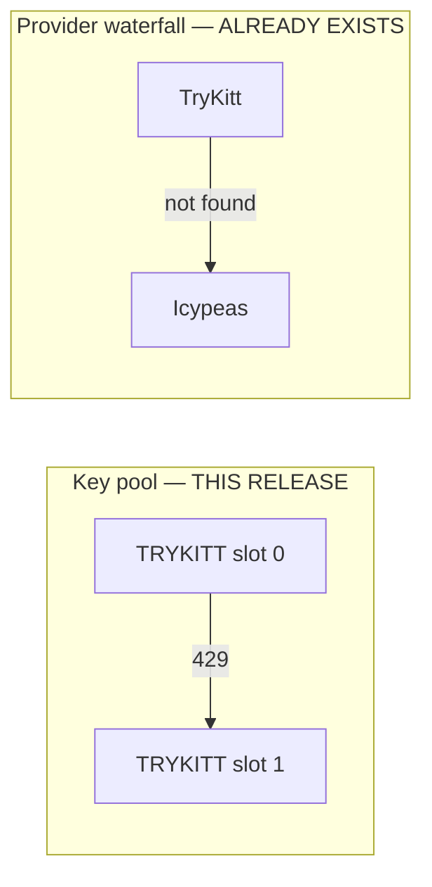
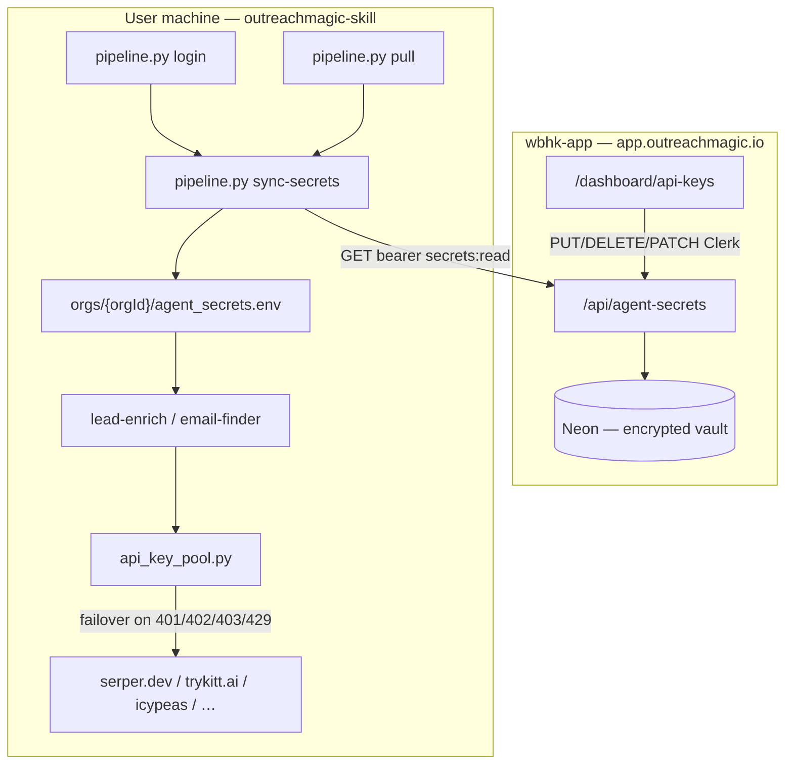
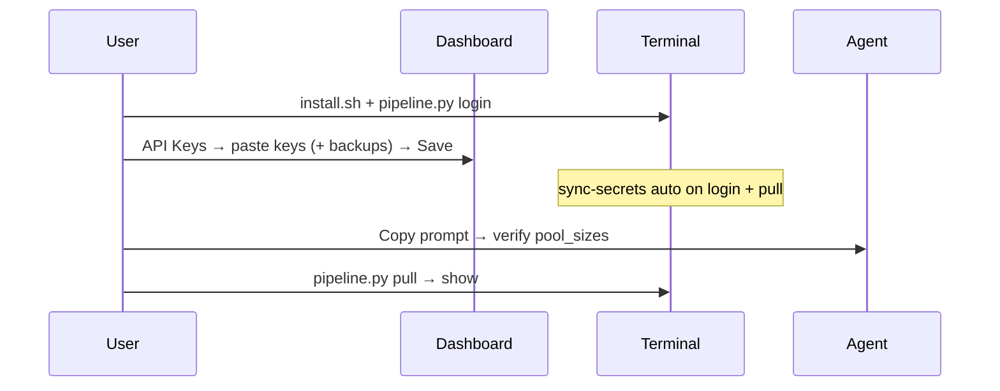
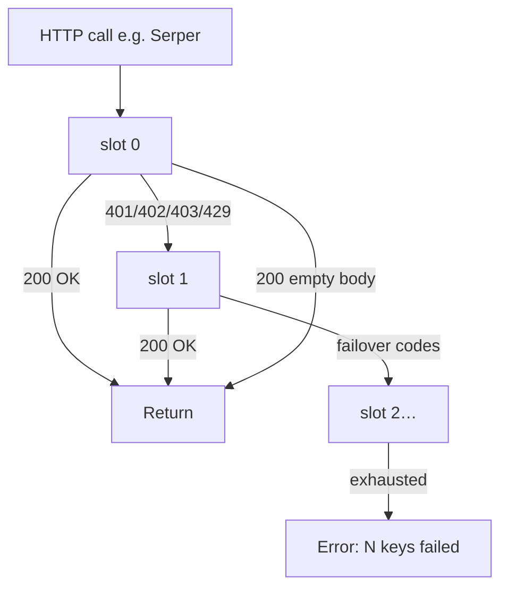

# Feature: Dashboard API Keys vault (org BYOK + key pools)

**Status:** Implemented (2026-06-06) — vault + pools + failover  
**Repos:** `wbhk-app` (portal + API), `outreachmagic-skill` (agent sync + companion loading)  
**Last updated:** 2026-06-06  
**Related:** [deepline-competitor-analysis.md](../positioning/deepline-competitor-analysis.md), [routing-config pattern](../../wbhk-app/docs/routing-config-contract.md) (when published)

---

## For implementers (LLM / engineer quick start)

**Read this section first.** One release — do not split vault and key pools across PRs unless blocked.

### Build order

| Step | Repo | Work |
|------|------|------|
| 1 | `wbhk-app` | Prisma + migrations + `agent-secrets.ts` + API routes |
| 2 | `wbhk-app` | `/dashboard/api-keys` UI with pool slots + reorder |
| 3 | `outreachmagic-skill` | `agent_secrets_cloud.py` + `sync-secrets` + login/pull hooks |
| 4 | `outreachmagic-skill` | Companion env loading + `api_key_pool.py` + failover wiring |
| 5 | Both | Docs, Agent Setup Steps, tests, scope migration |

**Copy these files as templates (do not reinvent):**

| Pattern | Copy from |
|---------|-----------|
| Dual auth (Clerk + agent bearer) | `wbhk-app/src/lib/agent-auth.ts` → `resolveRoutingAuth()` |
| Version bump + bundle | `wbhk-app/src/lib/routing-config.ts` |
| API route shape | `wbhk-app/src/app/api/routing-config/route.ts` |
| Agent cloud sync | `outreachmagic-skill/skills/outreachmagic/scripts/routing_cloud.py` |
| Encrypt at rest | `wbhk-app/src/lib/token-crypto.ts` → `encryptToken()` / `decryptToken()` |
| Dashboard card layout | `wbhk-app/src/components/pipeline-routing-manager.tsx` (patterns only) |

### Acceptance criteria (all required for ship)

**Vault & sync**

- [ ] User saves keys in dashboard → never sees plaintext after save (Saved / Not set + `updatedAt`)
- [ ] User adds 2+ keys per provider with reorder (up/down); max 5 slots
- [ ] `pipeline.py login` and `pull` auto-sync secrets (non-fatal on failure)
- [ ] `sync-secrets --check` reports `configured` + `pool_sizes` (never values)
- [ ] Synced keys override `.zshrc` / legacy env for same variable name
- [ ] Per-org path `{data_root}/orgs/{organizationId}/agent_secrets.env` (mode 600)
- [ ] Existing agent keys get `secrets:read` via migration (no re-login)

**Key pools & failover**

- [ ] Sync writes `SERPER_API_KEY` + `SERPER_API_KEY__1`, `SERPER_API_KEY__2`, …
- [ ] Serper/TryKitt/Icypeas/MillionVerifier failover on `401/402/403/429` per HTTP request
- [ ] HTTP 200 with empty valid body does **not** trigger failover
- [ ] Failover logs `provider`, `env_key`, `slot` — never secret values
- [ ] Custom keys support same pool model (`APOLLO_API_KEY__1`, …)

---

## Build scope: ship vs defer

Locked for this release. **Do not implement** deferred items unless product owner explicitly expands scope.

### Ship in this release

| Area | What |
|------|------|
| **Vault** | Org-scoped encrypted storage, built-in catalog + custom keys |
| **UI** | Provider cards, multi-slot list, up/down reorder, add/remove/update per slot |
| **API** | `GET/PUT/DELETE /api/agent-secrets`, `PATCH /api/agent-secrets/reorder` |
| **Sync** | `sync-secrets`, auto on login/pull, `--check`, per-org `agent_secrets.env` |
| **Env** | `override_existing` load order; `SERPER_API_KEY` in lead-enrich `_API_KEY_VARS` |
| **Failover** | `api_key_pool.py` wired into Serper, TryKitt, Icypeas, MillionVerifier HTTP calls |
| **Auth** | Clerk writes; agent `secrets:read` for GET plaintext; scope migration |
| **Docs** | SKILL.md, Agent Setup Steps, `agent-secrets-contract.md` |

### Explicitly defer (not in this release)

| Item | Why defer | When |
|------|-----------|------|
| Server-side "Test connection" | Secrets would hit our servers | Never for BYOK vendors |
| Proxy vendor calls through OM API | Privacy / scope | Separate product decision |
| `disabledAt` UI toggle | DELETE is enough for v1 | v2 if users ask for pause-without-delete |
| Local cooldown / `agent_secrets_state.json` | Complexity; per-request failover is enough | v2 |
| Failover on `500/502/503` | Vendor outage ≠ bad key | v2 |
| `pipeline.py secrets set --stdin` (CLI push) | Dashboard is primary path | Tier B |
| Agent bearer `secrets:write` | No CLI push in v1 | Tier B |
| Audit log (who rotated keys) | Org roles not built | Tier C |
| OAuth for enrichment vendors | Sequencers use **Connections** | Tier C |
| Per-workspace different Serper keys | Org scope is enough | Not planned |
| Reporting slot failures back to dashboard | Needs new API + UI | v2 |
| Version short-circuit (skip GET if unchanged) | Routing doesn't do it; keep simple | Optional later |
| Drag-and-drop reorder library | No DnD dep in wbhk-app; use ↑↓ buttons | Revisit if UX feedback |

### Two waterfall concepts (do not conflate)



- **Key pool:** same vendor, multiple accounts (`TRYKITT_API_KEY` → `TRYKITT_API_KEY__1`)
- **Provider waterfall:** different vendors (`email-finder` TryKitt then Icypeas) — unchanged; pools apply *within* each provider call

---

## Pre-build decisions (locked)

No blocking open questions. Defaults below unless product owner overrides before merge.

| Decision | Choice | Notes |
|----------|--------|-------|
| Reorder UX | **Up/down arrow buttons** | No new npm deps; compact slots `0..n-1` after each reorder |
| Reorder API body | `{ envKey, order: string[] }` | `order` = secret row `id`s in desired priority (top = slot 0) |
| `disabledAt` field | **In schema, unused in v1** | DELETE to remove; no disable toggle in UI |
| Custom key pools | **Yes** | Same slot model as builtins |
| Max slots per envKey | **5** (slots 0–4) | Enforced server-side |
| Shared failover module | **`skills/outreachmagic/scripts/api_key_pool.py`** | Import from both companions (add skill dir to path or copy minimal helpers) |
| Icypeas failover | **Initial POST + poll read** | Both use `call_with_key_pool` with same key for a single find operation |
| Serper error wrapping | **Refactor** `serper_search` to raise/return HTTP status before wrapping | So failover sees real status codes |
| `organization_id` in config | **Store on login + sync** | Key: `organization_id` in `outreachmagic_config.json` |
| Custom keys in portal bundle | **Grouped under Custom section** | Each custom envKey gets same `slots[]` shape as builtins |

---

## Summary

Users save third-party API keys in **Dashboard → API Keys**, encrypted in Neon, synced locally as `agent_secrets.env`. **Multiple keys per provider** with automatic failover when a key is rate-limited, out of credits, or rejected.

Enrichment APIs are called **from the user's machine**, not proxied through OM servers. Validation is local (`sync-secrets --check` + agent copy-prompt).

Replaces: `~/.zshrc`, `~/.hermes/.env`, per-skill `config.json` scattered across Cursor, Claude, and Hermes.

---

## Architecture

### System overview



### Credential types (keep separate)

| Credential | Purpose | Storage |
|------------|---------|---------|
| Agent key (`om_agent_*`) | Device auth, pull, sync | `outreachmagic_config.json` via `login` |
| Vendor keys (`SERPER_API_KEY`, …) | Companion API calls | Dashboard vault → `agent_secrets.env` |

**Never** store `OUTREACHMAGIC_AGENT_KEY` in the BYOK vault.

### Onboarding flow



**5-step install** (Agent Access, SKILL.md, install.sh):

1. Install skill
2. `pipeline.py login`
3. Dashboard → API Keys (primary + optional backup keys)
4. `sync-secrets` (automatic on login/pull)
5. `pull` → `show`

---

## Goals

1. One setup surface after login — paste keys in app, sync automatic
2. Org-scoped keys — agency vault, all devices sync
3. Key pools — multiple keys per provider, local auto-failover
4. Custom keys — `APOLLO_API_KEY`, etc., with same pool support
5. Dumb vault — save/delete/reorder; no server-side vendor test
6. Agent-friendly verify — copy-prompt + `sync-secrets --check`
7. Dashboard wins — synced keys override shell/legacy env

### Non-goals

- Proxying vendor API calls through `api.outreachmagic.io`
- OM-hosted credit packs
- Per-workspace Serper keys
- OAuth for enrichment vendors (→ **Connections**)

---

## UX / IA

### Nav

**API Keys** in sidebar — between **Connections** and **Agent Access**.

| Area | Purpose |
|------|---------|
| Connections | Sequencer webhooks |
| API Keys | BYOK + key pools |
| Agent Access | Install, login, devices |

### Page: `/dashboard/api-keys`

1. **Hero** — "Test in your agent" copy-prompt
2. **Companion skills** — provider cards with slot lists
3. **Custom keys** — same slot UI per custom envKey
4. **Footer** — version `v{N}`, sync reminder, precedence note

### Provider card (built-in + custom)

```
Serper (lead-enrich)                    [+ Add backup key]
  Required for lead-enrich · serper.dev signup ↗

  ┌──────────────────────────────────────────────────────────┐
  │ ↑↓  Primary      Saved · Jun 6, 2026     [Update] [Remove] │
  │ ↑↓  Backup #1    Saved · Jun 4, 2026     [Update] [Remove] │
  └──────────────────────────────────────────────────────────┘
  2 keys configured · Failover tries top → bottom on quota errors
```

- **+ Add backup key** — next slot if `< 5`
- **↑↓** — calls `PATCH /api/agent-secrets/reorder`
- **Update** — `PUT` with `slot` + new `value`
- **Remove** — `DELETE` with `envKey` + `slot`; recompact remaining slots
- Status badge: `Saved` / `Not set`; show `slotsConfigured` count
- Never show plaintext after save

### Cross-links

| Location | Change |
|----------|--------|
| `agent-access-content.tsx` | Link to API Keys |
| `agent-setup-steps.tsx` | Steps 3–4: API Keys URL + `sync-secrets` |
| `agent-install-commands.ts` | `syncSecretsCommandForPlatform()` in post-install |
| `COMPANION_SKILLS_BUNDLE` | Link `/dashboard/api-keys`; mention backup keys |
| `SKILL.md` | 5-step path + pool failover one-liner |

---

## Built-in catalog

`src/lib/agent-secrets-catalog.ts`:

| Env key | Label | Skill | Required? | Signup |
|---------|-------|-------|-----------|--------|
| `SERPER_API_KEY` | Serper | lead-enrich | If using lead-enrich | https://serper.dev |
| `TRYKITT_API_KEY` | TryKitt | email-finder | One of TryKitt / Icypeas | https://trykitt.ai |
| `ICYPEAS_API_KEY` | Icypeas | email-finder | One of TryKitt / Icypeas | https://app.icypeas.com |
| `MILLIONVERIFIER_API_KEY` | MillionVerifier | email-finder | Optional | https://www.millionverifier.com |

**Custom keys:** `^[A-Z][A-Z0-9_]{0,127}$`, optional label ≤ 120 chars. Reject custom form if `envKey` is in catalog.

**Pool limit:** max 5 slots per `envKey` per org.

---

## Key pools & automatic failover

### Failover flow



### Failover rules

| HTTP status | Failover? |
|-------------|-----------|
| `401`, `403` | Yes |
| `402` | Yes |
| `429` | Yes |
| `200` (incl. empty valid result) | No |
| `400`, `404`, `422` | No |
| `500`, `502`, `503` | No (deferred) |

### Synced env format

```dotenv
SERPER_API_KEY=primary
SERPER_API_KEY__1=backup-agency
SERPER_API_KEY__2=backup-personal
```

`api_key_pool("SERPER_API_KEY")` → `["primary", "backup-agency", "backup-personal"]` (skip empty).

### Module: `skills/outreachmagic/scripts/api_key_pool.py`

```python
_FAILOVER_HTTP_CODES = frozenset({401, 402, 403, 429})

def api_key_pool(env_key: str) -> list[str]: ...

def is_failover_http_status(code: int) -> bool: ...

def call_with_key_pool(
    env_key: str,
    fn: Callable[[str], T],
    *,
    provider: str,
) -> T:
    """Try fn(api_key) for each slot; failover only on _FAILOVER_HTTP_CODES."""
```

**Wire into:**

| File | Function | Env key |
|------|----------|---------|
| `lead-enrich/scripts/enrich.py` | `serper_search()` | `SERPER_API_KEY` |
| `email-finder/scripts/providers.py` | `trykitt_find_email()` | `TRYKITT_API_KEY` |
| `email-finder/scripts/providers.py` | icypeas find + poll | `ICYPEAS_API_KEY` |
| `email-finder/scripts/millionverifier.py` | verify | `MILLIONVERIFIER_API_KEY` |

**Implementation note:** Refactor provider functions to accept `api_key: str` param; outer caller uses `call_with_key_pool`. Log to stderr on failover:

```
[outreachmagic] serper: SERPER_API_KEY slot 1 failed (429), trying slot 2
```

---

## Data model (Prisma)

```prisma
model Organization {
  agentSecretsVersion Int @default(1)
  agentEnvSecrets     OrgAgentEnvSecret[]
}

model OrgAgentEnvSecret {
  id              String       @id @default(cuid())
  organizationId  String
  envKey          String
  slot            Int          @default(0)
  label           String?
  valueCiphertext String
  disabledAt      DateTime?    // schema only v1; unused
  createdAt       DateTime     @default(now())
  updatedAt       DateTime     @updatedAt
  organization    Organization @relation(fields: [organizationId], references: [id], onDelete: Cascade)

  @@unique([organizationId, envKey, slot])
  @@index([organizationId, envKey])
}
```

- Encrypt with `encryptToken()` / `decryptToken()`
- Bump `agentSecretsVersion` on PUT, DELETE, reorder
- On DELETE slot: recompact slots to `0..n-1` without gaps

### Scope migration (deploy)

```sql
UPDATE "AgentKey"
SET scopes = array_append(scopes, 'secrets:read')
WHERE "revokedAt" IS NULL
  AND NOT ('secrets:read' = ANY(scopes));
```

```prisma
scopes String[] @default([
  "events:read", "routing:read", "routing:write",
  "connections:read", "connections:write", "secrets:read"
])
```

---

## API contract

**Routes:**

| Method | Path | Auth | Body |
|--------|------|------|------|
| `GET` | `/api/agent-secrets` | Clerk masked / Agent plaintext | — |
| `PUT` | `/api/agent-secrets` | Clerk | `{ envKey, value, label?, slot? }` |
| `DELETE` | `/api/agent-secrets` | Clerk | `{ envKey, slot? }` default slot 0 |
| `PATCH` | `/api/agent-secrets/reorder` | Clerk | `{ envKey, order: string[] }` |

**Reorder:** `order` is secret row IDs in priority order. Server reassigns `slot` 0..n-1. Validate all IDs belong to org + envKey.

**Portal bundle:**

```ts
type AgentSecretsPortalBundle = {
  version: number;
  entries: Array<{
    envKey: string;
    label: string | null;
    skill: string | null;
    builtin: boolean;
    configured: boolean;
    slotsConfigured: number;
    slots: Array<{
      id: string;           // for reorder
      slot: number;
      label: string | null;
      configured: boolean;
      updatedAt: string | null;
    }>;
  }>;
};
```

**Agent bundle:**

```ts
type AgentSecretsAgentBundle = {
  version: number;
  organizationId: string;
  secrets: Record<string, string[]>;  // ordered: index 0 = primary
};
```

**Middleware:** `/api/agent-secrets(.*)` public (auth in handler), like routing-config.

---

## Agent sync (`outreachmagic-skill`)

### `agent_secrets_cloud.py`

```python
CONFIG_AGENT_SECRETS_VERSION_KEY = "agent_secrets_version"
CONFIG_ORGANIZATION_ID_KEY = "organization_id"

def fetch_secrets_bundle(api_base, token) -> dict: ...
def write_agent_secrets_env(path, secrets: dict[str, list[str]], *, version) -> int: ...
def agent_secrets_path(data_root, organization_id) -> Path: ...
def maybe_sync_agent_secrets_from_cloud(*, quiet=False) -> bool: ...
```

Write `SERPER_API_KEY` + `SERPER_API_KEY__N` from arrays. File mode `600`. Store version + `organization_id` in config.

### CLI

```bash
python3 scripts/pipeline.py sync-secrets [--json] [--cron]
python3 scripts/pipeline.py sync-secrets --check [--json]
```

**`--check` output includes `pool_sizes`** (see acceptance criteria).

### Auto-sync hooks

Non-fatal on failure: after `login`, during `pull` (with routing sync).

### Companion env loading

**Files:** both `companion_common.py`

1. `load_dotenv_file(..., override_existing=False|True)`
2. Load chain: hermes `.env` → profile → repo → skill `default.env` → **`orgs/{orgId}/agent_secrets.env` last with `override_existing=True`**
3. Add `SERPER_API_KEY` to lead-enrich `_API_KEY_VARS`
4. Load keys matching `^[A-Z][A-Z0-9_]+(__\d+)?$` from synced file
5. Import `api_key_pool` in provider HTTP code paths

---

## Env precedence

| Priority | Source |
|----------|--------|
| 1 | `orgs/{orgId}/agent_secrets.env` after sync |
| 2 | Shell / `.zshrc` |
| 3 | `~/.hermes/.env`, profiles, `config.json` |

---

## Agent test prompt

```text
Sync my Outreach Magic API keys to this machine, then confirm which companion keys are set.
Do not print secret values — only report env key names and pool sizes.

Run in my terminal (not chat):
python3 ~/.hermes/skills/outreachmagic/scripts/pipeline.py sync-secrets

Then check:
python3 ~/.hermes/skills/outreachmagic/scripts/pipeline.py sync-secrets --check --json
```

---

## Implementation checklist

### wbhk-app

**Data + API**

- [ ] Prisma `OrgAgentEnvSecret` + `Organization.agentSecretsVersion`
- [ ] Migration `20260606120000_org_agent_env_secrets`
- [ ] Migration: append `secrets:read` to active agent keys
- [ ] `src/lib/agent-secrets-catalog.ts`
- [ ] `src/lib/agent-secrets.ts` — CRUD, encrypt, bundles, reorder, slot compact
- [ ] `src/app/api/agent-secrets/route.ts` — GET/PUT/DELETE
- [ ] `src/app/api/agent-secrets/reorder/route.ts` — PATCH
- [ ] `src/middleware.ts` — route matcher
- [ ] `docs/agent-secrets-contract.md`

**UI**

- [ ] `src/app/dashboard/api-keys/page.tsx` + `api-keys-content.tsx`
- [ ] Sidebar nav **API Keys**
- [ ] Provider cards: slot list, ↑↓ reorder, add backup, update/remove
- [ ] Custom keys section (same slot UI)
- [ ] Copy-prompt hero + version footer
- [ ] `agent-access-content.tsx` + `agent-setup-steps.tsx` + `agent-install-commands.ts`

### outreachmagic-skill

**Sync**

- [ ] `skills/outreachmagic/scripts/agent_secrets_cloud.py`
- [ ] `pipeline.py` — `sync-secrets`, `--check`, login/pull hooks
- [ ] `tests/test_agent_secrets_cloud.py`

**Companions**

- [ ] `api_key_pool.py`
- [ ] `companion_common.py` — override_existing, org path, `__N` keys
- [ ] `enrich.py` — `serper_search` pool failover
- [ ] `providers.py` — TryKitt, Icypeas pool failover
- [ ] `millionverifier.py` — pool failover
- [ ] `tests/test_api_key_pool.py`
- [ ] `tests/test_lead_enrich.py` / `test_email_finder.py` — failover cases

**Docs**

- [ ] `SKILL.md`, lead-enrich/email-finder SKILL.md, `install.sh` post-install

---

## Security

| Rule | Implementation |
|------|----------------|
| No plaintext in browser after save | Masked portal bundle only |
| No decrypted values in logs | Redact everywhere |
| Local file `chmod 600` | On every sync write |
| Clerk-only writes | Agent GET read-only |
| No keys in chat | Terminal-only sync |
| Gitignore | Document `agent_secrets.env` |

---

## Testing plan

### wbhk-app

1. PUT slot 0 + slot 1 → GET shows 2 slots, no plaintext
2. DELETE slot 0 → slot 1 becomes slot 0 (recompact)
3. Reorder via PATCH → slots reflect new priority
4. 6th slot PUT → 400 max slots
5. Agent GET without scope → 403
6. Agent GET with scope → ordered arrays

### outreachmagic-skill

1. `write_agent_secrets_env` emits `__N` suffixes
2. `api_key_pool()` order correct with gaps skipped
3. Mock 429 slot 0 → slot 1 succeeds
4. Mock 200 empty → no second attempt
5. `override_existing` beats `.zshrc`
6. `--check` includes `pool_sizes`, no values

### E2E

1. Dashboard: primary + backup Serper → sync → `pool_sizes.SERPER_API_KEY === 2`
2. Exhaust primary (or mock) → lead-enrich succeeds via backup
3. Log shows `slot 1`, not key material

---

## Future extensions (post-ship)

| Tier | Feature |
|------|---------|
| B | CLI `secrets set --stdin`, agent `secrets:write` |
| B | REST write via agent key (CI) |
| C | Audit log, org admin roles |
| C | `disabledAt` UI, failure telemetry to dashboard |
| C | Local cooldown state file |
| — | Failover on 5xx, OM proxy/credits |

---

## Related fixes (separate PRs)

1. Login stuck on "Logging in…" — `AuthScreen` redirect
2. Prosp duplicate event labels — `platform_registry.py`

---

## Reference: routing config pattern

| Concern | Routing | Agent secrets |
|---------|---------|---------------|
| Version | `routingConfigVersion` | `agentSecretsVersion` |
| Module | `routing_cloud.py` | `agent_secrets_cloud.py` |
| Local | SQLite | `agent_secrets.env` |
| Auto-sync | login, pull | login, pull |

---

## Changelog

| Date | Change |
|------|--------|
| 2026-06-04 | Initial spec |
| 2026-06-06 | Deepline benchmark, per-org paths, `--check`, LLM guide |
| 2026-06-06 | Key pools + failover spec |
| 2026-06-06 | **Merged into single release** — build scope table, locked decisions, unified checklist |
