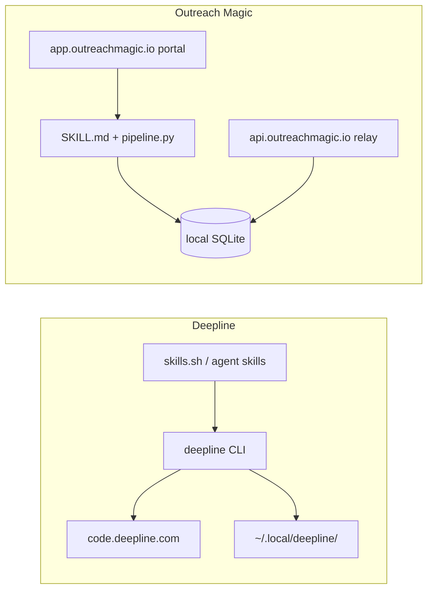

# Deepline — competitor analysis

**Status:** Living doc (brainstorm + product strategy)  
**Last updated:** 2026-06-04  
**Category:** GTM agent skills / prospecting CLI (adjacent to Outreach Magic, not direct pipeline-relay substitute)

---

## Summary

[Deepline](https://code.deepline.com) is a **cloud-first GTM agent product** with a branded CLI (`deepline`), browser OAuth, host-scoped local config under `~/.local/deepline/`, and distribution through the [skills.sh](https://skills.sh) ecosystem (flagship skill: [deepline-gtm](https://www.skills.sh/site/code.deepline.com/deepline-gtm)).

**Outreach Magic should not compete as “another GTM meta skill.”** Deepline optimizes **time-to-first prospecting win** (ICP → list with email/LinkedIn). OM optimizes **pipeline visibility** (sequencer events → local SQLite → agent queries). The install/onboarding patterns are worth copying; the data model and positioning are not.

Canonical OM line (all listings): see [hub-copy.md](./hub-copy.md) — *Every other GTM skill tells your agent what to write. Outreach Magic tells your agent what's happening.*

Related OM work: [dashboard-agent-api-keys.md](../feature-requests/dashboard-agent-api-keys.md), [registry-publish.md](../registry-publish.md), [gap-analysis.md](./gap-analysis.md).

---

## Primary links

| Resource | URL |
|----------|-----|
| Deepline product / CLI host | https://code.deepline.com |
| CLI install script (live, version-pinned) | https://code.deepline.com/api/v2/cli/install |
| CLI Python bundle endpoint | https://code.deepline.com/api/v2/cli/python |
| Skills registry index (used by installer) | https://code.deepline.com/.well-known/skills/index.json |
| deepline-gtm on skills.sh | https://www.skills.sh/site/code.deepline.com/deepline-gtm |
| skills.sh docs (CLI, badges, ranking) | https://www.skills.sh/docs |
| Open-source `skills` CLI | https://github.com/vercel-labs/skills |
| Outreach Magic site | https://outreachmagic.io |
| Agent setup (OM) | https://app.outreachmagic.io/setup/agent |
| OM public install repo | https://github.com/outreachmagic/outreachmagic |

---

## What Deepline is (product shape)

From public installer behavior, skills.sh listing copy, and agent onboarding playbooks:

1. **Branded CLI** — single `deepline` command on PATH (`~/.local/bin` by default).
2. **Account-bound** — `deepline auth register` opens a browser; OAuth-style connection to Deepline account.
3. **Host-scoped install tree** — production host `code.deepline.com` maps to slug `code-deepline-com` under `~/.local/deepline/`.
4. **Agent skills pack** — installer runs `npx skills add` against their index, targeting **codex**, **claude-code**, and **cursor** globally.
5. **Meta GTM skill** — `deepline-gtm` routes prospecting, enrichment, verification, scoring, personalization, activation; emphasizes **companies first, then people**.
6. **Playground / backend runtime** — post-install `deepline backend refresh-runtime` syncs a playground environment (cloud-side).
7. **Optional telemetry** — user opt-in for sharing session prompts to Deepline (`DEEPLINE_SHARE_SESSION_USER_PROMPTS`).

skills.sh listing notes (as of research, 2026-06): **~4.2K installs**, source `code.deepline.com`, install command `npx skills add https://code.deepline.com`.

---

## Documented agent onboarding playbook (8 steps)

This is the flow competitors/agents are taught to run for Deepline (paraphrased from internal playbooks):

| Step | Action |
|------|--------|
| 1 | `curl -fsSL "https://code.deepline.com/api/v2/cli/install" -o /tmp/deepline-install.sh` |
| 2 | User reviews the script (security) |
| 3 | Tell user browser will open for account connect; run `sh /tmp/deepline-install.sh` |
| 4 | Ensure `deepline` on PATH (`~/.local/bin`); if missing, prefix commands with `export PATH=$HOME/.local/bin:$PATH &&` |
| 5 | Confirm: `deepline auth status` |
| 6 | Optional: allow Claude to run `deepline` without permission prompts — add to `~/.claude/settings.json` under `permissions.allow`: `Bash(deepline *)` and `Bash(export PATH=$HOME/.local/bin:$PATH && deepline *)` |
| 7 | Optional telemetry: ask user; write `DEEPLINE_SHARE_SESSION_USER_PROMPTS=true|false` to `~/.local/deepline/<host-slug>/.env` (e.g. `code-deepline-com`, `localhost-3000`) |
| 8 | Optional demo: quickstart workflow (e.g. find 5 CTOs at NY startups with emails + LinkedIn) via `/deepline-quickstart` |

**Activation metaphor:** Deepline’s “aha” is **greenfield prospecting**. OM’s equivalent is **`pipeline.py login` → `pull` → `show`** (see [demos/pull-to-pipeline.md](../demos/pull-to-pipeline.md)).

---

## What the install script actually does

Source: fetched `https://code.deepline.com/api/v2/cli/install` (dynamic; embeds version hashes). High-level behavior:

### Install layout (production host)

| Path | Purpose |
|------|---------|
| `~/.local/bin/deepline` | Shell wrapper → `deepline-real` (Python shiv) |
| `~/.local/bin/deepline-real` | Downloaded from `/api/v2/cli/python` |
| `~/.local/deepline/code-deepline-com/bin` | Alternate layout for local dev host |
| `~/.local/deepline/code-deepline-com/cli/` | `.install-method`, `.version` metadata |
| `~/.local/deepline/code-deepline-com/skills/` | Local skills metadata `.version` |
| `~/.local/deepline/<host-slug>/.env` | Host-scoped env (telemetry, config scope) |

Environment set by wrapper (production): `DEEPLINE_HOST_URL`, `DEEPLINE_CONFIG_SCOPE=code-deepline-com`, `DEEPLINE_REAL_BINARY`, `DEEPLINE_INSTALL_METHOD=shiv`.

### Other installer actions

- **SDK v1/v2 conflict handling** — may detect `deepline-sdk` / global npm `deepline` and prompt or remove before v1 install.
- **Windows** — `.cmd` wrappers under `~/.local/bin` and `%LOCALAPPDATA%\Deepline\bin\`.
- **PATH** — auto-append to `.zshenv` / `.bash_profile` / fish `config.fish` with marker `# deepline-cli-path`.
- **Node 20+** — wrapper resolves Homebrew/common node paths for some code paths.
- **Background jobs** — `deepline backend refresh-runtime`; `npx skills add` with pinned skill list.
- **Skills installed by default** (from installer): `build-tam`, `clay-to-deepline`, `deepline-feedback`, `deepline-gtm`, `deepline-quickstart`, `linkedin-url-lookup`, `niche-signal-discovery`, `portfolio-prospecting`, `workflow-hello-world` (via `npx skills add … --full-depth`).
- **Auth** — `deepline auth register` (browser).
- **Claude permissions** — interactive prompt to patch `~/.claude/settings.json` (installer can do this; step 6 above is the manual equivalent).
- **End** — `deepline quickstart` unless skipped.

Installer env overrides (non-interactive / CI): `DEEPLINE_INSTALLER_MODE`, `DEEPLINE_INSTALLER_SKIP_AUTH`, `DEEPLINE_INSTALLER_SKIP_PATH`, `DEEPLINE_INSTALLER_SKIP_QUICKSTART`, `DEEPLINE_INSTALLER_SKIP_AGENT_SKILL_INSTALL`.

---

## deepline-gtm skill (skills.sh)

**Listing:** https://www.skills.sh/site/code.deepline.com/deepline-gtm  

**Positioning (from listing):** “GTM Meta Skill” — prospecting, account research, contact enrichment, verification, lead scoring, personalization, campaign activation.

**Process goal (their words):** Customer goes from “I have an ICP” to “list of prospects with email/LinkedIn and personalized content/signals.”

**Discovery order:** **Companies first, then people** — do not start with broad people-search when the task is “contacts at companies matching criteria.”

**Install (listing):** `npx skills add https://code.deepline.com`

**Documentation hierarchy:** Meta skill routes decisions; long command chains in sub-docs; provider detail in `provider-playbooks/*.md`; supports paid and non-paid workflows including `--rows 0:1` one-row pilots.

---

## Architecture comparison



### Where data lives

| Aspect | Deepline | Outreach Magic |
|--------|----------|----------------|
| Primary user value | Prospecting / enrichment / activation workflows | Pipeline visibility from sequencers |
| System of record (agent queries) | Cloud workflows + CLI; local dirs mostly install/state | **Local SQLite** (`outreachmagic.db`) |
| CLI surface | Global `deepline` | `python3 scripts/pipeline.py` from skill install |
| Skill install | `npx skills add` + API-driven installer | `install.sh` git clone → `~/.hermes/skills` / `~/.cursor/skills` / `~/.claude/skills` |
| Cross-IDE | Same CLI + global skills | Same skill tree; optional **`data_root`** shares one DB across Hermes/Cursor/Claude |
| Auth | Browser OAuth via CLI | `pipeline.py login` → agent key in `outreachmagic_config.json` |
| Secrets (today) | Host `.env` + account | `.zshrc`, `~/.hermes/.env`, per-skill `config.json` |
| Secrets | — | Dashboard **API Keys** → `sync-secrets` → `config/agent_secrets.env` ([feature doc](../feature-requests/dashboard-agent-api-keys.md)) |
| Inbound network | Deepline API / playground | `pull` from `api.outreachmagic.io` (relay) |
| Outbound upload | Workflow-dependent (SaaS) | Explicit `pipeline.py sync` only |
| Windows | Strong (.cmd, Python shims) | SKILL metadata: `linux`, `macos` |
| Open install | Dynamic curl script + binary blob | GitHub `install.sh` + MIT source |

---

## Category map (why we are not the same product)

| Category | Examples | Does | Does not |
|----------|----------|------|----------|
| Strategy / content | ColdIQ, GTM Flywheel | How to think, write, sequence | Persist pipeline state |
| Execution / prospecting | Extruct, **Deepline**, sales-skills | Research, enrich, activate lists | Mirror live sequencer replies at scale |
| **Data infrastructure** | **Outreach Magic** | Local DB, relay pull, dedup before paid APIs | Replace Clay/Apollo-style net-new TAM building |

Deepline competes for **agent onboarding mindshare** on skills.sh and Claude/Cursor install flows. OM competes for **“what happened in my outbound stack?”** after sends.

---

## Strengths vs weaknesses (for OM strategy)

### Where Deepline is stronger

- **Single command brand** — `deepline auth status` is clearer than discovering `pipeline.py paths`.
- **Installer as product** — PATH, auth, skills, Claude Bash allowlist, telemetry, demo in one script.
- **skills.sh distribution** — `npx skills add` telemetry drives leaderboard visibility ([docs](https://www.skills.sh/docs)).
- **Host-scoped config** — avoids staging/prod env collisions.
- **Version coupling** — CLI hash + skills hash in install script keeps client and skill pack aligned with backend.

### Where Outreach Magic is stronger

- **Data ownership** — SQLite on disk; agent queries without fabricating reply history.
- **Sequencer integrations** — Smartlead, Instantly, Heyreach, PlusVibe, EmailBison ([SECURITY.md](../../SECURITY.md)).
- **Cross-platform data** — `data_root` intentionally shares one DB across agent IDEs.
- **Open install** — auditable GitHub install vs curl dynamic script + shiv binary.
- **Suite dedup economics** — lead-enrich / email-finder check OM DB before Serper/TryKitt ([skill-suite.md](../skill-suite.md)).
- **Hermes profile model** — symlinked global install under `~/.hermes/skills/` ([hermes-skills-layout.md](../hermes-skills-layout.md)).

### OM gaps exposed by Deepline (action items)

| Gap | Mitigation (recommended) |
|-----|---------------------------|
| Fragmented API key setup | Ship Dashboard **API Keys** + `pipeline.py sync-secrets` |
| No skills.sh presence | List `outreachmagic`, `lead-enrich`, `email-finder`; README badges; `npx skills add` in install.sh |
| Weak “first 2 minutes” in SKILL | Lead with `login` → `sync-secrets` → `pull` → `show` |
| No `.well-known/skills/index.json` | Optional on `app.outreachmagic.io` for one-command suite install |
| Claude permission friction | Document optional `settings.json` snippet; do not require auto-patch |

---

## Recommended Outreach Magic changes (from analysis)

**Do not change:** Data-layer positioning, local SQLite as source of truth, sequencer-first story, avoid “GTM meta skill” framing on skills.sh.

**Do change (priority):**

1. **Ship dashboard API keys** — org vault, local `agent_secrets.env`, precedence over `.env`; never proxy Serper/TryKitt through OM API for v1.
2. **skills.sh** — three listings, hub-copy blurbs, `npx skills add` + [registry-publish.md](../registry-publish.md) checklist.
3. **SKILL.md marketplace opening** — outcomes (“replies this week”, “bounces by campaign”) + 2-minute path; not “find 5 CTOs”.
4. **install.sh** — optional `npx skills add` for cursor/claude; post-install block: login → API Keys URL → sync-secrets → pull.
5. **setup/agent** — document shared `data_root` for Cursor + Claude on one machine.
6. **Post-launch skill** — “campaign intelligence” / reply insights that only works with OM DB ([launch-strategy.md](./launch-strategy.md)).

**Defer:** Cloud lead warehouse, prompt telemetry parity, Windows CLI parity, 50+ sub-skills.

---

## API keys: dashboard vs `.env`

| Layer | Use case |
|-------|----------|
| 1. Dashboard → `sync-secrets` → `agent_secrets.env` | Default for users and agencies |
| 2. `OUTREACHMAGIC_AGENT_KEY` / shell env | CI, power users |
| 3. Legacy `config.json`, `~/.hermes/.env` | Document as override / deprecated path |

Message: *Keys are stored in your Outreach Magic account and synced locally; enrichment APIs are still called from your machine, not through our servers.*

Deepline analogy: account + host `.env` for preferences; OM should match **account convenience** without matching **cloud-primary prospect data**.

---

## Install command reference (copy-paste)

**Deepline (competitor):**

```bash
curl -fsSL "https://code.deepline.com/api/v2/cli/install" -o /tmp/deepline-install.sh
# review script
sh /tmp/deepline-install.sh
deepline auth status
```

**Outreach Magic (ours):**

```bash
curl -fsSL https://raw.githubusercontent.com/outreachmagic/outreachmagic/main/install.sh -o install.sh
bash install.sh --platform cursor --with-lead-enrich --with-email-finder
# then: pipeline.py login, sync-secrets (when shipped), pull, show
```

**skills.sh (both ecosystems):**

```bash
# Deepline (listing)
npx skills add https://code.deepline.com

# OM (target — public repos)
npx skills add https://github.com/outreachmagic/outreachmagic --skill outreachmagic
```

---

## Threat level

| Risk | Level | Notes |
|------|-------|-------|
| Deepline adds sequencer webhook / pipeline DB | Medium | Would blur category; watch release notes |
| Deepline dominates skills.sh GTM rankings | Medium | Speed to list + differentiated copy |
| Users confuse OM with prospecting meta skills | Medium | Clear tags: `pipeline`, `replies`, `smartlead`, not only `gtm` |
| OM loses installs due to onboarding friction | High until API Keys ship | Deepline’s installer is the benchmark |

---

## Sources and method

- Install script inspection: `https://code.deepline.com/api/v2/cli/install` (2026-06).
- Agent onboarding playbook (internal competitor install steps).
- skills.sh public listing for deepline-gtm (install count, description) — https://www.skills.sh/site/code.deepline.com/deepline-gtm
- In-repo OM docs: [gap-analysis.md](./gap-analysis.md), [hub-copy.md](./hub-copy.md), [launch-strategy.md](./launch-strategy.md), [feature-requests/dashboard-agent-api-keys.md](../feature-requests/dashboard-agent-api-keys.md), [SECURITY.md](../../SECURITY.md).

Re-fetch install script before major product decisions; Deepline pins `CLI_VERSION` / `SKILLS_VERSION` in the live script and can change behavior without a public changelog in this repo.

---

## Changelog

| Date | Change |
|------|--------|
| 2026-06-04 | Initial doc: install flow, architecture, skills.sh, OM recommendations |
