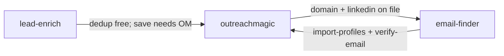

# Outreach Magic — GTM / Positioning Research Pack (single file)

**Generated:** 2026-06-03 · Paste this entire file into any research LLM (no repo links required).

**Table of contents**
1. [Final research prompt (v4)](#final-research-prompt-v4)
2. [Pricing (source of truth)](#source-pricingmd)
3. [Gap analysis](#source-gap-analysismd)
4. [Hub & marketplace copy](#source-hub-copymd)
5. [Launch strategy](#source-launch-strategymd)
6. [Skill path](#source-skill-pathmd)
7. [Skill suite & funnel](#source-skill-suitemd)
8. [Registry publish](#source-registry-publishmd)
9. [Install / website copy](#source-install-website-before-aftermd)
10. [Demo script](#source-pull-to-pipelinemd)
11. [Multi-workspace billing](#source-multi-workspace-snapshot-syncmd)
12. [Platform READMEs (Hermes, Cursor, Claude)](#source-platform-readmes)
13. [SKILL.md (agent product spec)](#source-skillmd)
14. [Email finder research](#source-email-finding-researchmd)
15. [Brand cohesion (marketing vs portal)](#source-brand-cohesionmd)
16. [Auth copy options](#source-auth-copy-optionsmd)
17. [Billing architecture](#source-billing-architecturemd)
18. [GTM conversion milestones](#source-gtm-conversion-milestonesmd)
19. [Analytics & tracking](#source-analytics-and-trackingmd)
20. [Stripe receipt branding](#source-stripe-receipt-brandingmd)
21. [Clerk email templates](#source-clerk-email-templatesmd)
22. [Tracking / SEO (legacy marketing site)](#source-tracking_old_appmd)
23. [wbhk-billing plans.ts (enforced limits)](#source-wbhk-billing-plansts)
24. [wbhk-app plans.ts (UI display)](#source-wbhk-app-plansts)

**Pricing note:** Shipped code/docs use **1,000 free relay events/mo** and **Pro $9/mo (50k cap)**. Some older portal copy still says $7 / 100 events — treat those as stale unless you intentionally revert.

---

## Final research prompt (v4)


> **Do deep research on skills/tools for AI SDRs, GTM, and lead generation** in the Hermes / Claude Code / Cursor / OpenClaw ecosystems.
>
> I'm building **Outreach Magic** — an infrastructure layer for AI SDR agents, GTM teams, and lead-gen agencies. It integrates with sequencers (Smartlead, HeyReach, Instantly) and tracks all lead activity / status like a CRM, plus manages list generation. It's local-first (SQLite, saves tokens) with cross-platform syncing via Cloudflare Workers/D1.
>
> **Before you research externally, read every `## SOURCE:` section below in this same file.** Treat them as prior art — extend and challenge them where useful, but don't ignore what's already shipped or drafted.
>
> **Check the existing site:** outreachmagic.io — it was originally focused on dashboards integrating with the same platforms. The website copy you write should work with this existing site, with minimal changes needed to repurpose it for the new product direction. See **brand-cohesion** and **tracking_old_app** sections below.
>
> ### Products & GTM gaps
> Core product = platform sync to a local DB with a dozen+ integrations. Plus free companion skills:
> - **Lead enrichment** (Serper API)
> - **Email finder** (Icypeas + TryKitt waterfall)
>
> These companion skills use the same local DB so they avoid re-doing work you've already done — minimizing wasted API credits.
>
> **Funnel idea:** The free email-finder / lead-enrich skills act as a discovery hook — users land on those, see they work seamlessly with Outreach Magic, and naturally upgrade to the full sync product. See **skill-suite** and **gap-analysis** sections below.
>
> **Help me:**
> 1. Identify **market gaps** in the AI SDR tooling space (compare to gap-analysis section)
> 2. Write precise **marketplace copy** (Hermes Hub, other skill DBs) — align with hub-copy and registry-publish sections
> 3. Write **website copy** for outreachmagic.io — fit within the existing site with minor tweaks
>
> ### Pricing strategy
> Charging model: **per event synced to the server**. Events = webhook payloads from sequencers + local changes synced back (1 event per lead synced). Each lead in N workspaces = N+1 events (1 core + N workspace). See **multi-workspace-snapshot-sync** section for the v2 snapshot billing model.
>
> | Version | Free | Paid |
> |---------|------|------|
> | V1 (research hypothesis) | 100 events/mo, 1 workspace | $7/mo unlimited events, unlimited workspaces |
> | **Shipped / drafted in repo** | 1,000 relay events/mo, 1 workspace | **$9/mo**, 50k relay cap (see pricing + wbhk-billing sections) |
> | Future | ??? | ??? |
>
> **Constraints:**
> - No-brainer pricing to drive traction now
> - Want to increase later without upsetting early users
> - Must protect against power users (100K+ events/mo → Cloudflare D1 costs)
> - Must stay dead simple — no complex tier math
> - Edge case: local bulk tag updates to 10K leads = 10K events synced back instantly
> - Also: same lead in 2 workspaces = 3 events (1 core + 2 workspace)
>
> **Deliver:**
> 1. A **2-plan structure** with reasoning (reconcile with pricing + wbhk-billing sections)
> 2. A **pricing roadmap** — where to start, when to raise, smooth transition
> 3. How to **protect server costs** without adding complexity
>
> ### Reddit launch strategy
> Do research-first: look at what's actually working for B2B SaaS, devtools, and sales tools on Reddit right now. Reference real examples of successful launches and community-building in r/SaaS, r/sales, r/coldemail, r/salesdevelopment, r/devtools, and similar subreddits. **No dedicated Reddit playbook in this pack yet** — launch-strategy section only lists target subs.
>
> Then propose a plan using a combination of:
> - Support accounts
> - The founder's personal account
> - The @outreachmagic official account
>
> Suggest which accounts to use for what (announcements vs. helpful comments vs. support), which subreddits to target, and the overall rollout rhythm. Every recommendation should cite the research that backs it.

---

## SOURCE: pricing.md

# Outreach Magic — Pricing (launch)

> Maintainer source of truth. Hub copy and `SKILL.md` should match this doc (or the live portal if it differs).

## Plans

| Plan | Relay events/mo | Workspaces | Sequencer sync | Price |
|------|-----------------|------------|----------------|-------|
| **Free** | 1,000 | 1 | Manual pull only | $0 |
| **Pro** | 50,000 | Unlimited | All integrations | **$9/mo** |

Pro is capped at 50k relay events (not “unlimited”) — high enough that normal users never think about it.

## What never counts toward relay limits

- Hermes-originated tracking (`log-event`, `add-lead`, `update-stage`, etc.)
- Local queries (`show`, `stats`, `campaigns`, `history`)
- Import/export (`import-profiles`, `export-local`, `export`)
- Personalization store
- Email verification **recording** (`verify-email`)
- **lead-enrich dedup checks** (`enrich.py check` / `batch-check`) — local SQLite only
- **email-finder pre-checks** before trykitt — local SQLite only

Only **relay-synced webhook events** from connected sequencers count toward the monthly limit.

**What counts as a relay event:** any request that hits the Cloudflare relay — sequencer webhooks, agent sync (`push`), duplicate sync attempts, everything. When the limit is reached the relay returns **HTTP 429** and the event is **not stored** (no grace period).

## Third-party costs (not OM)

| Service | Skill | User pays |
|---------|-------|-----------|
| Serper.dev | lead-enrich | User's Serper key |
| trykitt.ai | email-finder | User's trykitt key |

Skills are MIT / free to install. Pro is for OM relay infrastructure at [outreachmagic.io](https://outreachmagic.io).

## Setup

Agent connect (not chat): `python3 ~/.hermes/skills/outreachmagic/scripts/pipeline.py login`

Portal: [app.outreachmagic.io/setup/agent](https://app.outreachmagic.io/setup/agent)

---

## SOURCE: gap-analysis.md

# Outreach Magic — Competitive Landscape & Gap Analysis
## May 2026

> Pricing and limits: [pricing.md](./pricing.md) — **1,000 free relay events/mo**, **Pro $9/mo** (50k cap).

---

## Market Overview

The AI agent skills ecosystem for GTM/SDR/lead generation is dominated by **Claude Code**. The ecosystem exploded in Q1 2026 with 7 major repos and multiple marketplaces. Hermes Hub has 652 skills total but essentially **zero** in the GTM/sales data infrastructure category.

---

## Competitive Landscape: Existing GTM Skills

### 1. ColdIQ GTM Skills
- **Size:** 7 master skills, 52 sub-skills
- **Focus:** Strategy + content generation
- **Gap:** No persistent data. No sequencer integration. No pipeline visibility.

### 2. Extruct GTM Skills
- **Focus:** End-to-end outbound campaigns — research, enrichment, email generation, sending
- **Gap:** Campaign execution, not pipeline tracking. No reply visibility after send.

### 3. GTM Flywheel
- **Focus:** Compounding framework — ICP research → signal scoring → cold email
- **Gap:** Process framework. No state, no sequencer sync, no persistence.

### 4. Claude GTM Plugin
- **Size:** 166 skills
- **Gap:** Massive but shallow. CRM skills talk *to* external CRMs; no local-first alternative.

### 5. GTM Agents
- **Size:** 92 agents + 52 skills
- **Gap:** Multi-agent orchestration. No data persistence layer between agents.

### 6. sales-skills/sales
- **Focus:** Prospecting, outbound, deals, proposals
- **Gap:** Router-based, stateless. No persistent pipeline.

### 7. Lead Gen Jay
- **Model:** Paid cohort ($2k-$3.5k)
- **Gap:** Paid course, not a product.

### 8. Marketing Skills
- **Size:** 32 skills, 12,800+ GitHub stars
- **Gap:** Marketing execution. No sales pipeline data.

---

## The Unified Gap: No Data Infrastructure Layer

| Category | Examples | What they do | What they DON'T do |
|---|---|---|---|
| **Strategy** | ColdIQ, GTM Flywheel | Tell agent *how* to think about GTM | Store data, track state |
| **Content** | ColdIQ email, Extruct | Generate copy, sequences, research | See replies, track pipeline |
| **Execution** | Extruct sending, sales-skills | Execute campaigns | Persist results across sessions |

**Outreach Magic is the only skill in a fourth category: Data Infrastructure.**

---

## Outreach Magic's Unique Positioning

1. **Persistent State** — SQLite survives reboots, session changes, platform switches
2. **Sequencer Integration** — Smartlead, Instantly, Heyreach, PlusVibe, EmailBison
3. **Cross-Platform Sync** — push/pull relay across Claude Code, Cursor, Hermes
4. **Credit-Saving Dedup** — lead-enrich checks local DB before Serper credits
5. **Free Tier With Real Value** — 1,000 relay events/mo + unlimited local tracking
6. **Hermes Hub First-Mover** — zero in GTM/sales data infrastructure

---

## Threats & Watch List

| Threat | Risk | Mitigation |
|---|---|---|
| ColdIQ or Extruct adds database/persistence | Medium | Speed to market + sequencer integrations |
| Sequencers build AI agent integrations | Low | Cross-sequencer unification is the value |
| Claude Code adds native state persistence | Low | Domain-specific schema beats generic state |
| Large CRM adds AI agent SDK | Medium | Local-first is a philosophical differentiator |

---

## Recommended Go-to-Market Order

1. **Hermes Hub** — uncontested category
2. **skills.sh** — cross-platform registry
3. **Agensi** — paid listings support
4. **MCP Market** — developer mindshare
5. **ColdIQ directory** — GTM practitioners
6. **Product Hunt** — broader launch
7. **Reddit** — r/coldemail, r/sales, r/claude, r/hermesagent

See [launch-strategy.md](./launch-strategy.md) and [../registry-publish.md](../registry-publish.md) for submission checklists.

---

## SOURCE: hub-copy.md

# Outreach Magic — Hub & marketplace copy

> Canonical positioning line (all listings):
>
> **Every other GTM skill tells your agent what to write. Outreach Magic tells your agent what's happening.**

Pricing aligned with [pricing.md](./pricing.md): **1,000 free relay events/mo**, **Pro $9/mo** (50k relay cap).

---

## outreachmagic — short blurb

> The data layer your AI agent has been missing. Sync leads, replies, and campaign events from Smartlead, Instantly, Heyreach, PlusVibe, and EmailBison into a local SQLite database your agent can query directly. Free forever for local tracking and 1,000 relay events/mo. Pro $9/mo for sequencer sync. One `pipeline.py pull` and your agent sees your entire pipeline.

**Tags:** `sales` `outreach` `crm` `pipeline` `leads` `email` `linkedin` `webhooks` `smartlead` `instantly` `sqlite` `gtm`

**Related skills:** `lead-enrich`, `email-finder`

**Category (Hub metadata only):** `productivity` — filesystem stays `~/.hermes/skills/outreachmagic/`

---

## lead-enrich — short blurb

> Research people with Serper.dev before you burn API credits. Checks Outreach Magic first — if the lead already has LinkedIn + email at the same company, **zero Serper credits**. Built-in model extraction; saves via outreachmagic. Top of the Outreach Magic suite funnel.

**Tags:** `sales` `enrichment` `research` `linkedin` `serper` `leads` `pipeline`

**Related skills:** `outreachmagic`, `email-finder`

**External domains:** `google.serper.dev` (required), `api.outreachmagic.io` (via outreachmagic save)

---

## email-finder — short blurb

> Find work emails with trykitt.ai after you have name + company domain (from lead-enrich or your CRM). Checks Outreach Magic first so you never pay twice. Saves email + verification status via outreachmagic. Requires outreachmagic + `TRYKITT_API_KEY`.

**Tags:** `sales` `email` `enrichment` `trykitt` `leads` `pipeline`

**Related skills:** `outreachmagic`, `lead-enrich`

**External domains:** `api.trykitt.ai` (required for find)

---

## Registry order

1. Hermes Hub  
2. skills.sh  
3. Agensi / MCP directories (as bandwidth allows)  
4. ClawHub last  

Each listing: one link to [outreachmagic.io](https://outreachmagic.io) + setup URL [app.outreachmagic.io/setup/agent](https://app.outreachmagic.io/setup/agent).

---

## Website hero

**Headline:** Your AI Agent Has a Blind Spot. Fix It.

**Subheadline:** Claude Code and Cursor can write brilliant cold outreach. But after they hit send, they go blind. Outreach Magic gives your AI agent a persistent memory of every lead, every reply, every bounce — across every sequencer you use.

**CTA:** [Start Free] [See How It Works]

**Social proof:** "From zero to full pipeline visibility in under 2 minutes. One command."

---

## Website feature blocks

**Stop Stitching CSVs** — Before: export from Smartlead, Heyreach, Instantly, merge in Sheets. After: `pipeline.py pull` → done.

**Local-First by Design** — SQLite on your machine. Push/pull relay to move between Claude Code, Cursor, Hermes.

**Actually Free to Start** — Unlimited local tracking + 1,000 relay events/mo. Pro $9/mo for sequencer sync.

**Built for AI Agents** — Structured CLI output. Every workflow assumes an LLM is on the other end.

**Cross-Platform. One Pipeline.** — Push from one machine, pull on another.

---

## Short copy snippets (social / directories)

**Ultra-short:** The data layer for AI SDRs. Sync Smartlead, Instantly, Heyreach into local SQLite.

**Pain-point hook:** Tired of exporting CSVs from Smartlead and Heyreach just to answer "did we get any replies?"

**Differentiation:** Every GTM skill tells your agent what to write. This one tells your agent what's happening.

---

## FAQ (website / pricing page)

**What counts as an event?** Relay-synced webhook events from connected sequencers. Local commands (`add-lead`, `show`, `stats`, dedup checks) are free and unlimited.

**What happens if I exceed my limit?** Free: friendly upgrade prompt; relay returns HTTP 429 when hard limit hit. Pro: 50k cap — we reach out personally if you're approaching it.

**Can I switch platforms?** `pipeline.py sync` on machine A, `pipeline.py pull --full` on machine B.

**Is it really free?** Yes for local tracking and 1,000 relay events/mo. Pro ($9/mo) unlocks full sequencer sync.

**Install:** [outreachmagic/outreachmagic](https://github.com/outreachmagic/outreachmagic) — `install.sh --platform hermes|cursor|claude`


---

## SOURCE: launch-strategy.md

# Outreach Magic — Launch Strategy & Cross-Platform Plan
## May 2026

> Repo layout: private dev monorepo `magic-creators/outreachmagic-skill`, public install repo `outreachmagic/outreachmagic`. See [../RELEASING.md](../RELEASING.md).

---

## 1. Should You Build a Suite of Skills?

**Yes, but not yet.** The strategy is sound — data-aware skills that plug into the Outreach Magic database compound the value. But you don't need a suite to launch. You have more differentiation with 3 skills than ColdIQ has with 52.

| Phase | What | Timeline |
|---|---|---|
| **Launch now** | outreachmagic + lead-enrich + email-finder | Ship immediately |
| **Week 2-3** | One flagship "wow" skill | Campaign intelligence |
| **Post-launch** | 2-3 more data-aware skills | Grow organically |

### The difference between their suite and yours

| ColdIQ / Extruct / etc | Outreach Magic suite |
|---|---|
| Strategy & content skills | Data-aware skills |
| "Write a cold email template" | "Which of my templates is winning? Show me the data." |
| Stateless — agent's working memory | Stateful — reads pipeline DB |
| Substitutable by any LLM | Non-substitutable — no LLM can fabricate Smartlead reply data |

### The flagship skill to build next

**Campaign Intelligence Skill** — Give the agent a prompt like "which of my templates is winning?" and it:
1. Queries the Outreach Magic DB
2. Groups replies by campaign/subject line
3. Analyzes positive reply rate, sentiment, bounce rate
4. Returns the winning template + the data behind it

Estimated build time: a weekend. Value: undeniable. Impossible for stateless skills to replicate.

### MVP launch checklist
- [x] Core pipeline DB + 5 sequencer integrations
- [x] Lead enrichment (credit-saving dedup)
- [x] Email finder (trykitt + dedup)
- [ ] Hermes Hub submission (copy in [hub-copy.md](./hub-copy.md))
- [ ] skills.sh listing
- [ ] One good demo video / Loom — see [../demos/pull-to-pipeline.md](../demos/pull-to-pipeline.md)

That's enough. Ship it. Grow post-launch.

---

## 2. Cross-Platform Strategy: One Canonical Skill, Multiple Distribution Channels

**Do NOT maintain separate versions per platform.** SKILL.md is portable. Python + SQLite work everywhere. Cross-platform is mostly install-path documentation.

### The plan

```
Private monorepo: magic-creators/outreachmagic-skill
    skills/outreachmagic/     ← canonical source
    skills/lead-enrich/
    skills/email-finder/
    install.sh                ← --platform hermes|cursor|claude

Public install repo: outreachmagic/outreachmagic
    (CI-published from monorepo on v* tag)
```

**Distribution order:**

| # | Platform | Why |
|---|---|---|
| 1 | **Hermes Hub** | Uncontested beachhead. Zero GTM data skills. Be *the* GTM skill on Hermes. |
| 2 | **skills.sh** | Captures Claude Code + Cursor users through distribution |
| 3 | **Agensi** | Supports paid listings |
| 4 | **MCP Market** | Developer mindshare |
| 5 | **ColdIQ directory** | Your exact audience (GTM practitioners) |

### Why Hermes first (not Claude Code first)

- Claude Code GTM ecosystem is crowded — 7 major repos, ColdIQ dominates mindshare
- Hermes Hub is empty in your category — zero competition
- You can be *the* GTM data skill on Hermes, versus *one of many* on Claude Code
- Then skills.sh captures the Claude/Cursor audience through a distribution channel

---

## 3. The Platform Positioning

Outreach Magic isn't just a skill. It's a **platform** that other skills build on.

> "Outreach Magic is the data layer that makes every other GTM skill smarter. Cold email skills can read reply history. Enrichment skills can skip duplicates. Campaign analyzers can report actual performance instead of guessing."

| Framing | Perception |
|---|---|
| "Another GTM skill" | Commodity. One of many. Competing with ColdIQ. |
| "The data layer for GTM skills" | Infrastructure. Foundation. Other skills integrate with *you*. |

---

## 4. Competitive Moat Summary

| Moat | Why It Matters |
|---|---|
| **Persistent SQLite** | Pipeline survives reboots and platform switches. Competitors are stateless. |
| **5 sequencer integrations** | Smartlead, Instantly, Heyreach, PlusVibe, EmailBison |
| **Cross-platform sync** | Push/pull relay = data follows you across Claude Code, Cursor, Hermes |
| **Credit-saving dedup** | lead-enrich checks local DB before burning API credits |
| **Genuine freemium** | 1,000 relay events/mo free — see [pricing.md](./pricing.md) |
| **Hermes Hub first-mover** | Zero in GTM/sales data infrastructure category |
| **Platform positioning** | Infrastructure, not commodity |

---

## 5. One-Liners (Internal Alignment)

- **Positioning:** "Every other GTM skill tells your agent what to write. Outreach Magic tells your agent what's happening."
- **Suite strategy:** "We don't need 52 skills. We need one database and a few skills that prove why it matters."
- **Cross-platform:** "One canonical skill. Multiple distribution channels. No platform-specific forks."
- **Platform play:** "Outreach Magic isn't a skill you use. It's the data layer every other GTM skill wishes it had."

---

## 6. Immediate Next Actions

1. Submit to Hermes Hub using [hub-copy.md](./hub-copy.md)
2. List on skills.sh
3. Record a 2-minute Loom — [pull-to-pipeline demo](../demos/pull-to-pipeline.md)
4. Post on r/coldemail, r/hermesagent, r/claude referencing the CSV-stitching pain point
5. Start the "campaign intelligence" skill as the first data-aware companion

---

## SOURCE: skill-path.md

# Skill install paths (launch)

**Do not migrate to `~/.hermes/skills/gtm/` at launch.** Hub category is metadata only.

```
~/.hermes/skills/
├── outreachmagic/     # data layer — SQLite, pipeline.py
├── lead-enrich/       # Serper research + dedup
└── email-finder/      # trykitt find + save
```

Profiles symlink: `~/.hermes/profiles/<name>/skills/<skill>` → `../../../skills/<skill>/`

Install: see [install-companions.md](../install-companions.md) (Hermes, Cursor, Claude).

Dev sync: `bash scripts/sync-local.sh`

See [../skill-suite.md](../skill-suite.md) for funnel and freemium rules.

---

## SOURCE: skill-suite.md

# Outreach Magic skill suite

Three intentional skills — not a 50-skill dump. **Outreach Magic is category 4: data infrastructure.** Strategy and copy skills stay stateless; OM is persistence.

> Every other GTM skill tells your agent what to write. Outreach Magic tells your agent what's happening.

## Funnel



| Skill | Role | Public repo | Release tag |
|-------|------|-------------|-------------|
| **outreachmagic** | Data layer — pipeline, relay, SQLite | `outreachmagic/outreachmagic` | `v*` |
| **lead-enrich** | Discovery — Serper, LinkedIn, domain | `outreachmagic/lead-enrich` | `lead-enrich-v*` |
| **email-finder** | Email find (trykitt v1) | `outreachmagic/email-finder` | `email-finder-v*` |

## Install order

1. **outreachmagic** — `pipeline.py init` then `pipeline.py login` in terminal  
2. **lead-enrich** — add `SERPER_API_KEY` to `~/.hermes/.env`  
3. **email-finder** (optional) — add `TRYKITT_API_KEY`; needs domain from enrich or CRM  

**Canonical install commands (Hermes, Cursor, Claude):** [install-companions.md](./install-companions.md)

## Soft dependency

- **lead-enrich** and **email-finder** work without outreachmagic for JSON/API helpers, but **dedup + save require OM**.
- `check` / `batch-check` exit with a clear error if outreachmagic is missing — Serper paths still work when OM is installed elsewhere.

## Freemium

| Free forever (no relay count) | Counts as relay event |
|------------------------------|------------------------|
| Local pipeline queries | Webhook events synced from sequencers |
| `import-profiles`, export | |
| lead-enrich dedup (`check`) | |
| email-finder OM pre-check | |
| `verify-email` recording | |

Launch limits: **1,000 relay events/mo free**, **Pro $9/mo** (50k cap). See [positioning/pricing.md](./positioning/pricing.md).

## Naming: email-finder vs verify-email

- **`email-finder`** skill — finds emails (trykitt API).
- **`pipeline.py verify-email`** — records verification result in SQLite (no external API).

## related_skills (Hermes frontmatter)

- outreachmagic → `[lead-enrich, email-finder]`
- lead-enrich → `[outreachmagic, email-finder]`
- email-finder → `[outreachmagic, lead-enrich]`

## Release docs

- [RELEASING.md](./RELEASING.md) — tags and CI  
- [registry-publish.md](./registry-publish.md) — marketplace order  

---

## SOURCE: registry-publish.md

# Registry publish checklist

Separate listings per skill. Skills are free (MIT); Pro is OM account only at [outreachmagic.io](https://outreachmagic.io).

## Priority order

| # | Channel | Slugs |
|---|---------|-------|
| 1 | [Hermes Hub](https://github.com/amanning3390/hermeshub) | `outreachmagic`, `lead-enrich`, `email-finder` |
| 2 | [skills.sh](https://skills.sh) | Same three |
| 3 | Agensi, MCP Market, ColdIQ directory | As bandwidth allows |
| 4 | ClawHub | After copy stable |

## Per-listing requirements

- One SEO link: https://outreachmagic.io  
- Setup: https://app.outreachmagic.io/setup/agent  
- Differentiation one-liner from [positioning/hub-copy.md](./positioning/hub-copy.md)  
- Pricing from [positioning/pricing.md](./positioning/pricing.md)  
- SkillScan strict pass before tag (see `scripts/skill-scan.sh`)

## Hermes Hub — Reviewed Domains

| Skill | Domains |
|-------|---------|
| outreachmagic | `api.outreachmagic.io`, `app.outreachmagic.io` |
| lead-enrich | `google.serper.dev` |
| email-finder | `api.trykitt.ai` |

Issue templates: `docs/hermeshub-reviewed-domains-*.md`

## GitHub release tags (monorepo → public repo)

| Skill | Monorepo tag | Public repo |
|-------|--------------|-------------|
| outreachmagic | `v1.20.x` | `outreachmagic/outreachmagic` |
| lead-enrich | `lead-enrich-v2.0.0` | `outreachmagic/lead-enrich` |
| email-finder | `email-finder-v1.0.0` | `outreachmagic/email-finder` (create repo) |

CI: `.github/workflows/publish-platforms.yml`, `publish-lead-enrich.yml`, `publish-email-finder.yml`

## Filesystem (no category migration)

`~/.hermes/skills/{outreachmagic,lead-enrich,email-finder}` — see [positioning/skill-path.md](./positioning/skill-path.md).

---

## SOURCE: install-website-before-after.md

# Install & update — website copy (before / after)

Use this page to update [app.outreachmagic.io/setup/agent](https://app.outreachmagic.io/setup/agent) and any docs that still reference the three platform-specific repos.

**What changed:** One public repo ([outreachmagic/outreachmagic](https://github.com/outreachmagic/outreachmagic)) replaces `hermes-outreachmagic`, `cursor-outreachmagic`, and `claude-code-outreachmagic`. Install uses `install.sh --platform <name>`. Update command is unchanged for users (`pipeline.py update`); downloads now come from the unified repo.

**Install URL:** Use `main` (no release tag) so users always get the latest `install.sh` and skill files from the default branch:

```text
https://raw.githubusercontent.com/outreachmagic/outreachmagic/main/install.sh
```

Omit `--tag`, `--lead-enrich-tag`, and `--email-finder-tag` on the install command for the same reason — each repo’s latest `main` is cloned.

**Updates after install:** `pipeline.py update` (no flags) pulls the latest **GitHub Release** on `outreachmagic/outreachmagic`. That is separate from install: install tracks `main`; update tracks releases.

---

## Optional companion skills

**outreachmagic alone is enough** for pipeline tracking, relay sync, and lead management. These two companions are optional add-ons:

| Skill | What it does | Requires |
|-------|----------------|----------|
| **lead-enrich** | Researches a person via Serper (Google Search): company domain, website, LinkedIn URL, job title, etc. Checks your local Outreach Magic DB first so you do not burn Serper credits on leads you already have. Saves enriched fields back into the pipeline. | `SERPER_API_KEY` ([serper.dev](https://serper.dev)) |
| **email-finder** | Finds work emails via trykitt.ai. Checks Outreach Magic first to skip duplicates. Saves the email and verification status into the pipeline. | `TRYKITT_API_KEY` ([trykitt.ai](https://trykitt.ai)) |

Add `--with-lead-enrich` and/or `--with-email-finder` to the install command when you want them. `--with-email-finder` implies `--with-lead-enrich`.

---

## Hermes

### Before

```bash
git clone https://github.com/outreachmagic/hermes-outreachmagic.git /tmp/om-hermes && \
  cp -r /tmp/om-hermes/{SKILL.md,scripts,references} ~/.hermes/skills/outreachmagic/ && \
  rm -rf /tmp/om-hermes
python3 ~/.hermes/skills/outreachmagic/scripts/pipeline.py init
python3 ~/.hermes/skills/outreachmagic/scripts/pipeline.py login
```

Optional one-liner (older curl install):

```bash
curl -fsSL https://raw.githubusercontent.com/outreachmagic/hermes-outreachmagic/main/install.sh | bash
python3 ~/.hermes/skills/outreachmagic/scripts/pipeline.py login
```

### After — outreachmagic only

```bash
curl -fsSL https://raw.githubusercontent.com/outreachmagic/outreachmagic/main/install.sh | bash -s -- \
  --platform hermes --migrate
python3 ~/.hermes/skills/outreachmagic/scripts/pipeline.py login
hermes -s outreachmagic
```

### After — with optional companions

```bash
curl -fsSL https://raw.githubusercontent.com/outreachmagic/outreachmagic/main/install.sh | bash -s -- \
  --platform hermes --migrate --with-lead-enrich --with-email-finder
python3 ~/.hermes/skills/outreachmagic/scripts/pipeline.py login
hermes -s outreachmagic
```

**Notes for Hermes page:**
- Real files still live under `~/.hermes/skills/outreachmagic/`
- Profiles still use symlinks only (`--migrate` fixes old full copies)
- `hermes -s outreachmagic` unchanged after install

---

## Cursor

### Before

```bash
curl -fsSL https://raw.githubusercontent.com/outreachmagic/cursor-outreachmagic/main/install.sh | bash
python3 ~/.cursor/skills/outreachmagic/scripts/pipeline.py login
```

### After — outreachmagic only

```bash
curl -fsSL https://raw.githubusercontent.com/outreachmagic/outreachmagic/main/install.sh | bash -s -- \
  --platform cursor
python3 ~/.cursor/skills/outreachmagic/scripts/pipeline.py login
```

### After — with optional companions

```bash
curl -fsSL https://raw.githubusercontent.com/outreachmagic/outreachmagic/main/install.sh | bash -s -- \
  --platform cursor --with-lead-enrich --with-email-finder
python3 ~/.cursor/skills/outreachmagic/scripts/pipeline.py login
```

**Notes for Cursor page:**
- Skill still installs to `~/.cursor/skills/outreachmagic/`
- Invoke in Agent chat with `/outreachmagic` or ask about your pipeline in plain English
- Optional `.mdc` rule is copied into the skill directory at install

---

## Claude Code

### Before

```bash
curl -fsSL https://raw.githubusercontent.com/outreachmagic/claude-code-outreachmagic/main/install.sh | bash
python3 ~/.claude/skills/outreachmagic/scripts/pipeline.py login
```

### After — outreachmagic only

```bash
curl -fsSL https://raw.githubusercontent.com/outreachmagic/outreachmagic/main/install.sh | bash -s -- \
  --platform claude
python3 ~/.claude/skills/outreachmagic/scripts/pipeline.py login
```

### After — with optional companions

```bash
curl -fsSL https://raw.githubusercontent.com/outreachmagic/outreachmagic/main/install.sh | bash -s -- \
  --platform claude --with-lead-enrich --with-email-finder
python3 ~/.claude/skills/outreachmagic/scripts/pipeline.py login
```

**Notes for Claude page:**
- Skill still installs to `~/.claude/skills/outreachmagic/`
- `SKILL.md` is the source of truth (legacy `CLAUDE_SNIPPET.md` is optional)

---

## Updating (all platforms)

### Before

```bash
python3 ~/.hermes/skills/outreachmagic/scripts/pipeline.py update
# or ~/.cursor/skills/... / ~/.claude/skills/... on other platforms
```

Downloads came from the platform-specific repo (`hermes-outreachmagic`, `cursor-outreachmagic`, or `claude-code-outreachmagic`).

### After

```bash
python3 <skill-path>/scripts/pipeline.py update
```

Same command and install path per platform. Downloads the latest **release** from **outreachmagic/outreachmagic**.

| Platform | Install path | Update command |
|----------|--------------|----------------|
| Hermes | `~/.hermes/skills/outreachmagic/` | `python3 ~/.hermes/skills/outreachmagic/scripts/pipeline.py update` |
| Cursor | `~/.cursor/skills/outreachmagic/` | `python3 ~/.cursor/skills/outreachmagic/scripts/pipeline.py update` |
| Claude Code | `~/.claude/skills/outreachmagic/` | `python3 ~/.claude/skills/outreachmagic/scripts/pipeline.py update` |

Check for updates without installing:

```bash
python3 <skill-path>/scripts/pipeline.py update --check
```

Pin a specific release (optional):

```bash
python3 <skill-path>/scripts/pipeline.py update --tag v1.21.0
```

---

## Pinning a version (optional)

If you ever need a fixed release instead of latest `main` at install time:

```bash
curl -fsSL https://raw.githubusercontent.com/outreachmagic/outreachmagic/v1.21.0/install.sh | bash -s -- \
  --platform hermes --migrate --tag v1.21.0
```

Most website copy should use **`main` with no tags** so install always tracks the latest.

---

## Repo URLs to retire on the website

| Old | New |
|-----|-----|
| `github.com/outreachmagic/hermes-outreachmagic` | `github.com/outreachmagic/outreachmagic` |
| `github.com/outreachmagic/cursor-outreachmagic` | *(same)* |
| `github.com/outreachmagic/claude-code-outreachmagic` | *(same)* |
| `raw.githubusercontent.com/outreachmagic/hermes-outreachmagic/...` | `raw.githubusercontent.com/outreachmagic/outreachmagic/main/...` |
| `raw.githubusercontent.com/outreachmagic/cursor-outreachmagic/...` | *(same)* |
| `raw.githubusercontent.com/outreachmagic/claude-code-outreachmagic/...` | *(same)* |

---

## One-line summary for marketing copy

> **One repo, every platform.** Install with `install.sh --platform hermes|cursor|claude` from [github.com/outreachmagic/outreachmagic](https://github.com/outreachmagic/outreachmagic). Same local paths, same `pipeline.py update`. Add `--with-lead-enrich` / `--with-email-finder` only if you want research and email-finding companions.

---

## SOURCE: pull-to-pipeline.md

# Demo script — pull to pipeline (2 min)

Use for Loom / launch video. Terminal only for `login`; agent can run read commands.

## Setup (before recording)

- outreachmagic installed, `pipeline.py login` done  
- At least one sequencer connected or sample events in relay  
- Optional: lead-enrich installed with Serper key  

## Beat 1 — Problem (15s)

"Your AI can write outreach, but it can't see replies. Outreach Magic is the data layer — local SQLite your agent queries directly."

## Beat 2 — Pull (30s)

```bash
python3 ~/.hermes/skills/outreachmagic/scripts/pipeline.py pull
python3 ~/.hermes/skills/outreachmagic/scripts/pipeline.py show
```

Call out: relay events imported; everything else stayed local.

## Beat 3 — Reply insight (45s)

```bash
python3 ~/.hermes/skills/outreachmagic/scripts/pipeline.py history --email prospect@company.com
python3 ~/.hermes/skills/outreachmagic/scripts/pipeline.py campaigns
```

"What's happening, not what to write."

## Beat 4 — Funnel (30s, optional)

```bash
python3 ~/.hermes/skills/lead-enrich/scripts/enrich.py check "Jane Doe" "Acme Corp"
```

"Zero Serper credits if Jane is already in the database."

## Close

- Free: 1,000 relay events/mo + unlimited local  
- Pro: $9/mo — [outreachmagic.io](https://outreachmagic.io)  
- Install: [app.outreachmagic.io/setup/agent](https://app.outreachmagic.io/setup/agent)

---

## SOURCE: multi-workspace-snapshot-sync.md

# Multi-workspace snapshot sync (v2)

Relay stores lead snapshots in two D1 tables:

| Table | Action | Key |
|-------|--------|-----|
| `relay_lead_core_snapshots` | `lead_core_update` | `(organization_id, entity_key)` |
| `relay_lead_workspace_snapshots` | `lead_workspace_update` | `(organization_id, entity_key, workspace_slug)` |
| `relay_company_snapshots` | `company_update` | `(organization_id, entity_key)` |

Usage billing: **one unit per successful snapshot upsert** (hash-unchanged rows are skipped and not billed).

## Local pending flags

- `leads.cloud_pending` — org-wide profile (core)
- `workspace_leads.cloud_pending` — tags, status, activity, LinkedIn per workspace

## Cutover runbook (single org)

1. Deploy `wbhk-worker` migration `0005_relay_snapshot_v2.sql` and worker code.
2. Update outreachmagic skill on the machine with the canonical SQLite DB.
3. Run:

```bash
pipeline.py sync --full-snapshot-v2
```

4. Verify `sync --status` shows zero pending core/workspace snapshots.
5. Optional: fresh DB + `pull --full` on another machine to confirm round-trip.

Pull uses three snapshot cursors: `last_snapshot_core_after_id`, `last_snapshot_workspace_after_id`, `last_snapshot_company_after_id`. On first read, `last_snapshot_after_id` (pre-v1.22) is migrated into the workspace cursor and removed from config.

Sync JSON uses `lead_snapshots_pushed` (core + workspace snapshot upserts). Legacy `lead_update` / `lead_create` / `relay_lead_snapshots` are removed.

---

## SOURCE: platform READMEs

### Hermes
# Outreach Magic for Hermes

The simplest pipeline tracker for AI agents. Auto-logs every outreach action to a local SQLite database. Connect Smartlead, Heyreach, Instantly, PlusVibe via paid relay.

## Install

Skills live in `~/.hermes/skills/` (real files). Each Hermes profile gets symlinks — not copies.

```bash
curl -fsSL https://raw.githubusercontent.com/outreachmagic/hermes-outreachmagic/v1.20.20/install.sh | bash -s -- \
  --with-lead-enrich --with-email-finder --migrate \
  --tag v1.20.20 \
  --lead-enrich-tag v2.0.2 \
  --email-finder-tag v1.0.2
```

Full suite install docs: [install-companions.md](https://github.com/magic-creators/outreachmagic-skill/blob/main/docs/install-companions.md)

```bash
python3 ~/.hermes/skills/outreachmagic/scripts/pipeline.py login
hermes -s outreachmagic
```

## Quick Start

```bash
python3 ~/.hermes/skills/outreachmagic/scripts/pipeline.py pull
python3 ~/.hermes/skills/outreachmagic/scripts/pipeline.py show
python3 ~/.hermes/skills/outreachmagic/scripts/pipeline.py stats
```

## Update

```bash
python3 ~/.hermes/skills/outreachmagic/scripts/pipeline.py update
python3 ~/.hermes/skills/lead-enrich/scripts/enrich.py update
python3 ~/.hermes/skills/email-finder/scripts/email_finder.py update
```

## Verify install

```bash
readlink ~/.hermes/profiles/<name>/skills/outreachmagic   # → ../../../skills/outreachmagic
python3 ~/.hermes/skills/outreachmagic/scripts/pipeline.py paths
```

## Pricing

- **Free:** Local tracking + CLI pipeline view + **1,000 relay events/month**
- **Pro ($9/mo):** Sequencer sync (50k relay events/month cap)

Sign up at [outreachmagic.io](https://outreachmagic.io)

## License

MIT

### Cursor
# Outreach Magic for Cursor

The simplest pipeline tracker for AI agents. Auto-logs every outreach action to a local SQLite database. Connect Smartlead, Heyreach, Instantly, PlusVibe via paid relay.

## Install

Get your Agent Key at [app.outreachmagic.io/setup/agent](https://app.outreachmagic.io/setup/agent), then run:

```bash
curl -fsSL https://raw.githubusercontent.com/outreachmagic/cursor-outreachmagic/main/install.sh | bash
python3 ~/.cursor/skills/outreachmagic/scripts/pipeline.py login
```

That's it. Restart Cursor and in Agent chat run:

> /outreachmagic

Or ask: "show me my pipeline"

## Update

```bash
curl -fsSL https://raw.githubusercontent.com/outreachmagic/cursor-outreachmagic/main/install.sh | bash
```

(Re-running without a key updates the skill in place; your local database and config are preserved.)

## Manual install

If you'd rather not pipe a script to bash:

```bash
git clone https://github.com/outreachmagic/cursor-outreachmagic.git /tmp/om-cursor
mkdir -p ~/.cursor/skills/outreachmagic
cp -a /tmp/om-cursor/. ~/.cursor/skills/outreachmagic/
rm -rf /tmp/om-cursor
python3 ~/.cursor/skills/outreachmagic/scripts/pipeline.py init
python3 ~/.cursor/skills/outreachmagic/scripts/pipeline.py login
```

### Project-level rule (optional)

For a single repo only, copy the rule file into that project:

```bash
mkdir -p .cursor/rules
cp ~/.cursor/skills/outreachmagic/outreachmagic.mdc .cursor/rules/
```

## Usage

Open any project in Cursor. In Agent chat, run `/outreachmagic` or ask:

- "Show me my pipeline"
- "How is outreach going?"
- "Pull latest events and show stats"
- "Show my campaigns"

## Pricing

- **Free:** Unlimited agent-originated tracking, CLI pipeline view, 1 platform, 1,000 relay events/month
- **Pro ($9/mo):** 50,000 relay events/month, all platform connections, multi-workspace routing

Sign up at [outreachmagic.io](https://outreachmagic.io) · Upgrade at [app.outreachmagic.io](https://app.outreachmagic.io/dashboard/billing)

## License

MIT

### Claude Code
# Outreach Magic for Claude Code

The simplest pipeline tracker for AI agents. Auto-logs every outreach action to a local SQLite database. Connect Smartlead, Heyreach, Instantly, PlusVibe via paid relay.

## Install

Get your Agent Key at [app.outreachmagic.io/setup/agent](https://app.outreachmagic.io/setup/agent), then run:

```bash
curl -fsSL https://raw.githubusercontent.com/outreachmagic/claude-code-outreachmagic/main/install.sh | bash
python3 ~/.claude/skills/outreachmagic/scripts/pipeline.py login
```

That's it. Restart Claude Code and ask:

> "show me my pipeline"

## Update

```bash
curl -fsSL https://raw.githubusercontent.com/outreachmagic/claude-code-outreachmagic/main/install.sh | bash
```

(Re-running without a key updates the skill in place; your local database and config are preserved.)

## Manual install

If you'd rather not pipe a script to bash:

```bash
git clone https://github.com/outreachmagic/claude-code-outreachmagic.git /tmp/om-claude
mkdir -p ~/.claude/skills/outreachmagic
cp -a /tmp/om-claude/. ~/.claude/skills/outreachmagic/
rm -rf /tmp/om-claude
python3 ~/.claude/skills/outreachmagic/scripts/pipeline.py init
python3 ~/.claude/skills/outreachmagic/scripts/pipeline.py login
```

## Usage

Start Claude Code in your project directory and ask:

- "Show me my pipeline"
- "How is outreach going?"
- "Pull latest events and show stats"
- "Show my campaigns"

## Pricing

- **Free:** Unlimited agent-originated tracking, CLI pipeline view, 1 platform, 1,000 relay events/month
- **Pro ($9/mo):** 50,000 relay events/month, all platform connections, multi-workspace routing

Sign up at [outreachmagic.io](https://outreachmagic.io) · Upgrade at [app.outreachmagic.io](https://app.outreachmagic.io/dashboard/billing)

## License

MIT

---

## SOURCE: SKILL.md

---
name: outreachmagic
description: >
  The outreach data layer for AI agents. Syncs events, replies, and lead
  attributes from Smartlead, Instantly, Heyreach, PlusVibe, and EmailBison
  into a local SQLite database your agent can query directly. Use for pipeline
  views, client briefings, deliverability diagnostics, campaign breakdowns,
  segment performance, and reply copy insights. Webhook payloads pass through
  api.outreachmagic.io; your data lives in a local SQLite file on your machine.
  Free tier: local tracking plus 1,000 relay events/mo. Pro: sequencer sync.
version: 1.23.7
author: Outreach Magic
license: MIT
platforms: [linux, macos]
metadata:
  cursor:
    tags: [sales, outreach, crm, pipeline, leads, email, linkedin, webhooks, smartlead, instantly, sqlite, gtm]
    related_skills: [lead-enrich, email-finder]
    external_domains:
      - domain: api.outreachmagic.io
        purpose: Relay webhooks and authenticated event pull (payloads imported to local SQLite)
      - domain: app.outreachmagic.io
        purpose: Portal API for tokens, billing, and workspace routing config sync
  hermes:
    tags: [sales, outreach, crm, pipeline, leads, email, linkedin, webhooks, smartlead, instantly, sqlite, gtm]
    category: productivity
    related_skills: [lead-enrich, email-finder]
    external_domains:
      - domain: api.outreachmagic.io
        purpose: Relay webhooks and authenticated event pull (payloads imported to local SQLite)
      - domain: app.outreachmagic.io
        purpose: Portal API for tokens, billing, and workspace routing config sync
---

# Outreach Magic — Pipeline Visibility

The outreach data layer for AI agents. Auto-logs outreach to a local SQLite database.
Free forever for local work. Connect Smartlead, Heyreach, Instantly via paid relay.

**Outreach Magic suite:** Pair with **lead-enrich** (Serper research + free dedup) and
**email-finder** (trykitt find). See [skill suite docs](https://github.com/outreachmagic/outreachmagic/blob/main/docs/skill-suite.md).

## CLI convention

All commands below use the pipeline CLI in this skill's `scripts/` directory (run from the skill root, or use absolute paths from `pipeline.py paths`):

```bash
python3 scripts/pipeline.py <command>
```

Resolve install paths anytime:

```bash
python3 scripts/pipeline.py paths
```

Optional config keys: `data_root` (share one DB across platforms), `api_base_url`, `dev_repo` for local development.

## Platform install

Install from [outreachmagic/outreachmagic](https://github.com/outreachmagic/outreachmagic):

```bash
curl -fsSL https://raw.githubusercontent.com/outreachmagic/outreachmagic/main/install.sh -o install.sh
bash install.sh --platform hermes --with-lead-enrich --with-email-finder --migrate
```

Pin a release (optional): add `--tag v1.21.5 --lead-enrich-tag v2.0.2 --email-finder-tag v1.0.2`.

Use `--platform cursor` or `--platform claude` for other agents. Setup: https://app.outreachmagic.io/setup/agent

### Hermes profiles

- **Real install:** `~/.hermes/skills/outreachmagic/` — never copy the full tree into `profiles/`
- **Profiles:** symlink only → `../../../skills/outreachmagic`
- **Verify:** `pipeline.py paths` (warns if a profile has a copy instead of a symlink)
- **Fix copies:** `install.sh --platform hermes --migrate --all-profiles`
- **Update:** `pipeline.py update` writes the global install; all profiles pick it up via symlink

### Cursor

Install to `~/.cursor/skills/outreachmagic/`. Invoke with `/outreachmagic` or ask about your pipeline in plain English.

### Claude Code

Install to `~/.claude/skills/outreachmagic/`. SKILL.md is the source of truth.

Environment variable: `OUTREACHMAGIC_AGENT_KEY` — overrides the config file `agent_key`. Set via `.env`, shell profile, or CI/CD.

## First-Time Setup (IMPORTANT — read this first)

On startup, **always check if the agent is already connected** by running:

```bash
python3 scripts/pipeline.py version
```

Then check whether an agent key exists in the config:

```bash
python3 scripts/pipeline.py pull
```

If `pull` returns an error like "No agent key or token configured", the user needs to set up.

**When setup is needed, tell the user exactly this:**

> Run this in your terminal (not in chat):
>
> `python3 scripts/pipeline.py login`
>
> A browser window will open — sign in or sign up, then authorize this device. Never paste secrets into chat.

If the skill is not installed yet, point them to **https://app.outreachmagic.io/setup/agent** or **https://app.outreachmagic.io/dashboard/agent** for install commands, then `login`.

`init` creates the database and project folders (`input/`, `export/`, `agent_resources/` under `<skill_home>/project` by default). Override with `"project_root"` in config.

If `pull` returns auth errors after a revoked key, tell them to run `login` again.

That's it. Don't list other commands, don't offer alternatives. Just: run `login` in terminal, done.

**When setup is already done** (pull succeeds or returns events), skip setup and go straight to showing data:

```bash
python3 scripts/pipeline.py pull
python3 scripts/pipeline.py show
```

## Network & privacy (Hermes / hub review)

- **Default:** All lead and pipeline data stays in local SQLite.
- **Inbound only:** `pull` imports webhook/agent events from `api.outreachmagic.io` (user- or cron-initiated).
- **Outbound upload:** Only when the user (or agent following user instruction) runs **`pipeline.py sync`**. Import and local edits never auto-upload.
- **Update check:** The CLI may query GitHub for a newer release tag (read-only, no lead data; at most once per hour). See [SECURITY.md](SECURITY.md).

## Version

**One version for the whole skill.** To see what is installed, always run:

```bash
python3 scripts/pipeline.py version
```

The `version:` line in this file is synced from `scripts/VERSION` on install/update. If unsure, use the command above.

**Updates are user-triggered.** The CLI may print an update notice (at most once per hour) when a newer GitHub **release** exists. It never downloads or replaces scripts automatically. Install updates with:

```bash
python3 scripts/pipeline.py update
# or
hermes skills update
```

Check without installing: `pipeline.py update --check`. Install a specific release: `pipeline.py update --tag v1.4.5`.

Install commands for each platform are in **Platform install** above. After install, run `python3 scripts/pipeline.py login`.

## When to Use

- You are about to send outreach (email, LinkedIn message, WhatsApp, etc.)
- You are researching a prospect and want to track them
- The user asks "show me my pipeline" or "how is outreach going"
- The user says "track this" followed by outreach details
- The user wants to connect a sequencer (paid — requires token)
- The user asks for campaign breakdowns or counts by campaign name
- The user asks for **workspace inventory** (counts by tag, LinkedIn connection accepted by sender)
- The user asks about connection status, webhook URLs, or platform health (`status`, `connections`)
- The user wants to add or remove a platform connection (`connect-platform`, `disconnect-platform`)

## Agent Behavior Rules (Important)

> **Note:** Agent rules below are a snapshot for GTM research. Install truth: `skills/outreachmagic/SKILL.md` (v1.25+ uses `pipeline.py query` for reads; pull only when freshness matters).

- For bulk enrichment: **`import-profiles`**, not repeated `add-lead`.
- **Reads:** `pipeline.py query engagement|replies|interested` for time-window analytics; read-only `query --sql` if needed.
- **Pull:** only when the user needs latest relay data or live timelines — not before local “last 48h” analytics.
- **Writes:** only `pipeline.py` mutation commands.
- Version: `pipeline.py version`. Message bodies: `history`. Copy: `copy-insights`.
- All-time campaign totals: `campaigns` / `stats`. Time windows: `query engagement`.
- Tags / LinkedIn by sender: `workspace summary --json`.
- Before debugging vendor events: `platform-map --json`.

## Pull policy (summary)

Run `pull` when the user wants fresh relay data. Skip pull for local time-window `query` analytics.

```bash
python3 scripts/pipeline.py pull
```

If routing sync times out but you only need relay events, use:

```bash
python3 scripts/pipeline.py pull --skip-routing-sync
```

This fetches the latest events from the relay, so the user always sees current data. The local DB may be stale. Never skip pull for activity/timeline queries. This applies across sessions: a new session's first pipeline query must pull.

**Pull progress:** The first page requests total pending count from the relay (`include_pending=1`). Webhook **events** use **1000 rows/page** (D1 memory limit). **Snapshots** may use **5000/page** on large backlogs. Example: `~14000 events pending (~14 pages @ 1000/page)`. Progress shows `records this page / total pending` until all pages import.

**Relay sync limits:** Same endpoints always — `POST /push` and `GET /pull`. No separate bulk URLs.

- **`sync` (upload):** When local `cloud_pending` snapshots ≥ **2500**, uses **5000 entries per `/push`**; otherwise routine batch size (default 200, max 500 per request).
- **`pull` (download):** **1000 rows/page** for webhook events; snapshots may use **5000/page** when the relay reports ≥ **2500** pending on the first snapshot page (`include_pending=1`).
- Filter downloaded data locally (`show --since`, workspace queries) — the relay does not filter by date or workspace.

### Workspace inventory (local DB — pull optional)

**`workspace summary`** reads local SQLite only (fast, works offline). Use when the user asks for counts by tag or LinkedIn sender connection state. Optional `pull` first if they need freshly synced tags/connection imports.

```bash
python3 scripts/pipeline.py workspace summary --workspace <slug> --json
```

Example JSON keys: `lead_count`, `last_pull`, `tags` (`tag`, `lead_count`), `linkedin_senders` (`sender_slug`, `connected`, `pending`), `linkedin_connected_leads`.

Tag-only (same tag data as summary): `pipeline.py tag list --workspace <slug>`.

## Free Tier

- Unlimited agent-originated tracking and local pipeline queries
- CLI pipeline view + web dashboard
- Pipeline stages with auto-advancement
- **1,000 relay events/month** (webhook sync from sequencers)

## Pro Tier ($9/mo)

- **50,000 relay events/month** (cap — covers most teams)
- Smartlead, Heyreach, Instantly, PlusVibe, EmailBison sync
- Multi-platform unified pipeline

Local import, export, dedup checks (lead-enrich), and `verify-email` recording do **not** count toward relay limits.

Sign up at https://outreachmagic.io

## Quick Start

```bash
python3 scripts/pipeline.py version
python3 scripts/pipeline.py show
python3 scripts/pipeline.py history --id 1
python3 scripts/pipeline.py history --email j@acme.com
python3 scripts/pipeline.py stats
python3 scripts/pipeline.py campaigns
python3 scripts/pipeline.py platform-map --json
python3 scripts/pipeline.py workspace summary --workspace <slug> --json
python3 scripts/pipeline.py copy-insights --lead-status interested --json
python3 scripts/pipeline.py import-profiles --file leads.csv
python3 scripts/pipeline.py agent-changes
python3 scripts/pipeline.py agent-changes --file changes.csv
```

### Status and connection management

Dashboard-style status, connection management, and webhook URL generation — all from the CLI. These commands talk to the app API and do not require a local database.

```bash
# Dashboard overview: plan, usage, per-platform health, routing
python3 scripts/pipeline.py status

# List all connections with webhook URLs and 30-day event counts
python3 scripts/pipeline.py connections
python3 scripts/pipeline.py connections --json

# Generate a webhook URL for a new platform
python3 scripts/pipeline.py connect-platform --platform smartlead

# Remove a platform connection (webhook URL stops working)
python3 scripts/pipeline.py disconnect-platform --platform smartlead
python3 scripts/pipeline.py disconnect-platform --platform smartlead --yes
```

### Agent-created changes (cross-platform sync)

Show locally-created leads and events (not from relay) as JSON or CSV. Useful for transferring data between platforms (Cursor, Hermes, Claude Code).

```bash
# JSON to stdout (pipe to relay push or save to file)
python3 scripts/pipeline.py agent-changes

# CSV file (import-profiles compatible)
python3 scripts/pipeline.py agent-changes --file local_changes.csv

# Filter to a specific workspace
python3 scripts/pipeline.py agent-changes --workspace leadgenph

# Include all leads (not just locally-created)
python3 scripts/pipeline.py agent-changes --all
```

**Push to relay for cross-platform sync:**

```bash
python3 scripts/pipeline.py sync
```

`sync` pushes pending lead snapshots (profile, `external_id`, `company_domain`, HQ/location, tags, mailmerge, workspace status, LinkedIn connection flags) plus local events, and **quarantine resolutions** (`skip` / `assign`) to the relay. Large backlogs use **5000 entries per `/push`** automatically (see relay sync limits above). At the end of the same command it may POST aggregate local DB health to the portal (file size, row counts, top tables — throttled ~6h). Skip with `sync --no-health-report`. Other machines run `pull --full` after a DB reset to restore everything that was synced.

### Quarantine (multi-workspace)

Unmapped relay events land in `unmapped_campaign_queue`. Resolve them locally, then `sync` so other machines and `pull --full` stay consistent:

```bash
python3 scripts/pipeline.py quarantine list
python3 scripts/pipeline.py quarantine list --status all --json
python3 scripts/pipeline.py quarantine skip --id QUEUE_ID
python3 scripts/pipeline.py quarantine assign --id QUEUE_ID --workspace WORKSPACE_SLUG
python3 scripts/pipeline.py sync
python3 scripts/pipeline.py pull
```

- **`skip`** — ignore junk/test events on the relay (permanent after sync).
- **`assign`** — route future pulls to a workspace (ingested on next `pull`, not immediately).
- **`replay`** — bulk re-ingest **pending** rows locally after adding `campaign-map` rules (no relay resolution).

Relay stores resolutions in D1 (`queue_resolutions`). The first event page of each `pull` requests them (`include_queue_resolutions=1`); later pages reuse the in-memory map.

**`sync --status` counters:** `recommended_mode` is `bulk` when `cloud_pending_leads` ≥ 2500 (else `push`). `relay_untracked_leads` = imported/local leads with no relay pull history (normal after CSV; data is still in the shared DB). `cloud_pending_leads` = rows waiting to push — run `sync`. `local_agent_events` = agent-originated events not yet on relay.

### Local database health

```bash
python3 scripts/pipeline.py db-health
python3 scripts/pipeline.py db-health --json
python3 scripts/pipeline.py db-health --full
```

Read `healthStatus`, `rulesTriggered` (each has a `hint`), `rowCounts`, and `tableBreakdown`. Cloud copy: `GET /api/agent/status` → `localDb` after user has run `sync`.

### Archive a workspace (local only)

```bash
python3 scripts/pipeline.py archive --workspace acme_corp --dry-run
python3 scripts/pipeline.py archive --workspace acme_corp --output ~/archives/acme_corp.db
python3 scripts/pipeline.py archive --workspace acme_corp --output ~/archives/acme_corp.db --purge
```

**Fresh DB + full CSV round-trip:**

```bash
pipeline.py import-profiles --file nace.csv --workspace acme_corp --import-batch-id nace-2026
pipeline.py sync
# new machine:
pipeline.py init && pipeline.py pull --full
```

**File-based transfer (no server):**

```bash
# Machine A: export
pipeline.py agent-changes --file changes.csv
# Machine B: import
pipeline.py import-profiles --file changes.csv --overwrite
```

### Workspace inventory

Counts by tag and LinkedIn connection accepted/pending per sender. **Local DB only** — no relay call; `last_pull` in output shows data freshness.

```bash
python3 scripts/pipeline.py workspace summary --workspace <slug> --json
python3 scripts/pipeline.py workspace summary --workspace <slug>
python3 scripts/pipeline.py tag list --workspace <slug>
```

### Campaign breakdown

Relay imports auto-populate campaign names from webhook payloads (Smartlead, PlusVibe, etc.).

```bash
python3 scripts/pipeline.py campaigns
python3 scripts/pipeline.py campaigns --json
```

`stats` also includes a campaign section. Use `campaigns` when the user only wants counts by campaign name.

### PlusVibe webhooks (status + sentiment)

Point PlusVibe webhooks at your relay URL (`…/plusvibe/{token}`). Subscribe separately to:

- **Reply events:** `ALL_EMAIL_REPLIES` (and optional `FIRST_EMAIL_REPLIES`, `ALL_POSITIVE_REPLIES`)
- **Label/status events:** `LEAD_MARKED_AS_INTERESTED`, `LEAD_MARKED_AS_NOT_INTERESTED`, `LEAD_MARKED_AS_OUT_OF_OFFICE`, plus any custom `LEAD_MARKED_AS_*` labels

Each webhook is stored as an event. **Interested / not interested / sentiment come from label webhooks**, not from reply webhooks alone. OOO is classified as **auto-reply** (metadata flag, query with `--auto-reply true`). Bounces set event sentiment `invalid` but **do not** auto-move the lead to stage `lost` (use `--sentiment invalid` to find them).

After `pull`, filter the pipeline by **current** status (latest status-bearing event per lead):

```bash
python3 scripts/pipeline.py show --sentiment positive
python3 scripts/pipeline.py show --sentiment invalid
python3 scripts/pipeline.py show --auto-reply true
python3 scripts/pipeline.py show --lead-status interested --json
```

Filter by date (created or updated on/after a date):

```bash
python3 scripts/pipeline.py show --since today
python3 scripts/pipeline.py show --since 2026-05-26 --json
python3 scripts/pipeline.py lead-table --workspace acme_corp --since today --json
```

Then open full timeline for any lead (all events, not just the status event):

```bash
python3 scripts/pipeline.py history --id 1
```

Native copy-performance analysis (full message bodies + best template):

```bash
python3 scripts/pipeline.py copy-insights --lead-status interested
python3 scripts/pipeline.py copy-insights --lead-status interested --json
```

`show --json` and `lead-table --json` include `personalization`, `tags`, and `latest_sender` when available.

### Export full profiles (CSV / JSON)

```bash
python3 scripts/pipeline.py export --workspace acme_corp --tag nace --format csv
python3 scripts/pipeline.py export --workspace acme_corp --since today --format json
```

Writes to `export/` by default. CSV uses `personalized_first_name`, `personalized_company_name`, plus lead fields, tags, HQ, and `latest_sender`.

### Reset local database (schema upgrade)

Prefer the guarded refresh command (syncs first, backs up, then rebuilds):

```bash
python3 scripts/pipeline.py refresh --yes
```

Preview tag fixes without writing:

```bash
python3 scripts/pipeline.py tag repair --dry-run
python3 scripts/pipeline.py tag repair
```

Manual equivalent (no pre-sync backup):

```bash
rm <skill_home>/databases/outreachmagic.db  # see pipeline.py paths
python3 scripts/pipeline.py init
python3 scripts/pipeline.py pull --full
```

**Tell your agent (rare):** “Run `pipeline.py refresh --yes` to back up, sync local changes to the relay, wipe the local DB, and re-import from the cloud. Do not use `pull --full` alone — it skips already-imported rows.”

`pull --full` only re-downloads relay pages; it does **not** clear `relay_ingested`. Use `refresh` when you need a true rebuild.

**LinkedIn IDs (v1.17):** Public profiles are stored in `linkedin_url` as `linkedin.com/in/handle` (no `https://`). Sales Nav (`ACwAA…`) and member IDs (`urn:li:member:…`) are stored as identity aliases and used for matching when the public slug arrives later.

## Core Workflow

### View a lead's full timeline

```bash
python3 scripts/pipeline.py history --id 1
python3 scripts/pipeline.py history --email jane@acme.com
python3 scripts/pipeline.py history --name "Jane Doe"
python3 scripts/pipeline.py history --id 1 --json
```

Outputs lead info + numbered event timeline with direction arrows (← inbound, → outbound),
human-readable timestamps, and event details.

### Add leads when researching prospects

```bash
python3 scripts/pipeline.py add-lead \
  --name "Jane Doe" --company "Acme Corp" --title "VP Marketing" \
  --industry "Martech" --headcount "50-200" \
  --email "jane@acme.com" \
  --channel email --stage prospecting
```

To also associate the lead with a workspace at creation time:

```bash
python3 scripts/pipeline.py add-lead \
  --name "Jane Doe" --email "jane@acme.com" --company "Acme Corp" \
  --workspace thesystemsmethod --stage contacted
```

`--workspace` is optional on `add-lead` — creating a lead is an org-wide operation. Use it when you know which workspace the lead belongs to; omit it when just researching.

If lead exists by email, LinkedIn, or (when both are missing) case-insensitive `name+company`, returns `{"status": "exists", "id": N}`.

### Bulk import / enrich (CSV, JSON, research dumps)

**Use `import-profiles` for spreadsheets, enriched exports, or batched research** — not repeated `add-lead` calls. Matching uses **tiered identities** (strongest first): `external_id` → email → LinkedIn → phone → name+domain → name+company → `import_key` (name-only rows). CSV columns `unified_lead_id` / `source_id` are accepted as aliases and stored as `external_id`. Fills empty fields only (same as relay/PlusVibe); use `--overwrite` to replace existing values.

```bash
python3 scripts/pipeline.py import-profiles \
  --file input/contacts_enriched.csv

python3 scripts/pipeline.py import-profiles \
  --file leads.json

python3 scripts/pipeline.py import-profiles \
  --json '[{"email":"j@acme.com","name":"Jane","job_title":"VP Marketing","industry":"Martech","headcount":"11-50","company":"Acme"}]'

python3 scripts/pipeline.py import-profiles \
  --file contacts.csv --dry-run

# With workspace association, tags, and LinkedIn status tracking
python3 scripts/pipeline.py import-profiles \
  --file contacts.csv --workspace default --sender-profile "https://linkedin.com/in/myprofile" \
  --source-detail "Q2 Apollo list" --import-batch-id "nace-2026-05"

# Rows with only name + company_domain + unified_lead_id (no email/LinkedIn)
python3 scripts/pipeline.py import-profiles \
  --file nace.csv --workspace acme_corp --import-batch-id nace-2026-05
```

**Core profile fields** (column aliases — first non-empty wins):

| Canonical field | Aliases | Required |
|---|---|---|
| `email` | `lead_email`, `work_email` | No (see identity tiers below) |
| `linkedin` | `linkedin_url`, `lead_linkedin_url`, `profile_url` | No |
| `name` | `full_name`, `display_name` (or `first_name` + `last_name`) | No |
| `title` | `job_title`, `role` | No |
| `company` | `company_name`, `organization`, `org` | No |
| `industry` | — | No |
| `headcount` | `company_size`, `employees`, `employee_count` | No |
| `location_city` | `city`, `lead_city` | No |
| `location_state` | `state`, `region`, `lead_state` | No |
| `location_country` | `country`, `lead_country` | No |

**Headcount normalization:** `headcount` is stored as-is (text) plus a computed `headcount_numeric` (integer midpoint). Ranges like `"11-50"` become `30`, `"500+"` becomes `500`, exact numbers pass through. Both leads and companies get the numeric column for sorting/filtering (`WHERE headcount_numeric BETWEEN 10 AND 100`).

**Extra fields** (auto-detected from CSV columns):

| Column | Effect |
|---|---|
| `company_domain` | Stored in `companies` table, normalized (strips protocol/www/path) |
| `hq_city` / `hq_state` / `hq_country` | Company HQ location, stored on `companies` table |
| `mailmerge_first_name` | Auto-populated as `first_name` in personalization table |
| `mailmerge_company_name` | Auto-populated as `company_name` in personalization table |
| `import_name` / `list_source` | Attribution + namespace for `external_id` when value has no `:` |
| `external_id` | CRM/list ID in `lead_identities` (namespaced `list_source:id` if bare) |
| `unified_lead_id`, `source_id` | Import aliases → same as `external_id` |
| `import_batch_id` (CLI flag) | Stable dedupe for name-only rows via `import_key` within a batch |
| `lead_status` | Requires `--workspace`; normalized (lowercase, spaces) and set on workspace_leads |
| `lead_sentiment` | Requires `--workspace`; normalized (lowercase) and set on workspace_leads |
| `tags` | Requires `--workspace`; semicolon or comma separated, normalized (lowercase), stored in `workspace_lead_tags` |
| `contact_order` | Requires `--workspace`; integer priority stored as `contact_priority` on workspace_leads |
| `is_connected_linkedin` | Requires `--workspace` + `--sender-profile`; `true`/`1`/`yes` sets connected status |
| `is_linkedin_request_pending` | Requires `--workspace` + `--sender-profile`; `true`/`1`/`yes` sets pending status |

**Normalization rules:**
- **Tags:** lowercased, whitespace collapsed — `"VIP"` and `"vip"` are the same tag
- **Status/sentiment:** lowercased, underscores to spaces — `"Not_Interested"` becomes `"not interested"`
- **Headcount:** range string preserved + numeric midpoint computed (`"11-50"` → 30)
- **Location:** stored as-is (city/state/country text)

**Attribution** is automatic: every import sets `original_source` (immutable first touch) and `latest_source` (updates each time) on the lead, following the Salesforce/HubSpot model. The `--source-detail` flag or `import_name`/`list_source` columns provide the detail.

### Personalization (mail-merge)

**Lead fields** (`first_name`, contact-specific lines): per lead. **Company fields** (`company_name`, `company_*`): org-wide, one write per account.

| Raw field | Mail-merge field | Scope |
|-----------|------------------|-------|
| `name` | `first_name` | lead |
| `company` / `companies.name` | `company_name` | company |

```bash
# Lead
python3 .../pipeline.py personalize-pending --fields first_name --json
python3 .../pipeline.py personalize-set --lead-id 5 --field first_name --value "Jane"
python3 .../pipeline.py personalize-set --lead-id 5 --field upcoming_event --value "SaaStr talk" --date 2026-09-10

# Company (org-wide)
python3 .../pipeline.py company-personalize-pending --fields company_name,company_icebreaker --json
python3 .../pipeline.py company-personalize-set --domain acme.com --field company_name --value "Acme"
python3 .../pipeline.py company-personalize-set --domain acme.com --field company_icebreaker --value "..."

# Read merged (export uses same shape: personalized_* columns)
python3 .../pipeline.py personalize-get --lead-id 5 --json
```

Import: `mailmerge_first_name` → lead; `mailmerge_company_name`, `mailmerge_company_*` → company. Sync pushes lead and company snapshots separately; merge is local.

### Email verification tracking (org-wide)

Record verification results from tools like ZeroBounce, NeverBounce, etc. Results are org-wide (not workspace-scoped). Platform bounces from Smartlead, Instantly, etc. are auto-recorded during relay sync.

```bash
# Record a verification result
python3 scripts/pipeline.py verify-email \
  --lead-id 5 --status valid --source zerobounce

# Batch verify from JSON
python3 scripts/pipeline.py verify-email --batch \
  --json '[{"lead_id":5,"status":"valid","source":"zerobounce"}]'

# Check verification status for a lead
python3 scripts/pipeline.py verify-status --lead-id 5
python3 scripts/pipeline.py verify-status --email j@acme.com

# List leads needing verification
python3 scripts/pipeline.py verify-pending --limit 50 --json
```

**Verification status values:** `valid`, `invalid`, `catch-all`, `unknown`, `spamtrap`, `abuse`, `do_not_mail`, `risky`, `bounced`, `soft_bounce`

**Bounce handling:** Platform bounces (from relay sync) are auto-recorded in `lead_email_verification` with `source="platform_bounce"`. Hard bounces override soft bounces. Tool verifications (ZeroBounce, etc.) take precedence over platform bounces — a tool "valid" result is only overridden by a hard bounce that came after the verification. The consolidated status is materialized on `leads.email_verification_status` for fast filtering.

### Companies and unified lead identity

- **`companies` table** — canonical company name, domain, industry, headcount (text + numeric midpoint), HQ location (city, state, country). Leads link via `company_id` (business email domain or company name on ingest).
- **Match by email and/or LinkedIn** — a lead can have email only, LinkedIn only, or both. Relay ingest resolves identity from webhook payload + envelope `lead` field.
- **Merge duplicates** when email and LinkedIn history were separate rows:
  - **Auto:** ingest with both identifiers matching two leads merges them (keeps row with more events).
  - **Manual:**

```bash
python3 scripts/pipeline.py merge-leads --keep 12 --merge 34
python3 scripts/pipeline.py merge-leads \
  --email j@acme.com --linkedin linkedin.com/in/janedoe
```

```bash
python3 scripts/pipeline.py history --linkedin linkedin.com/in/janedoe
```

After `pull`, use **`campaigns`** for per-campaign event and lead counts (unchanged).

### Log every outreach send

```bash
python3 scripts/pipeline.py log-event \
  --lead-id 1 --type email_sent --direction outbound \
  --subject "Quick intro" --workspace thesystemsmethod
```

`--workspace` is **required** in multi-workspace mode. Outreach events are workspace-scoped — they belong to a specific pipeline. In single-workspace mode it falls back to the default workspace.

### Update stage and log replies

```bash
python3 scripts/pipeline.py update-stage \
  --id 1 --stage replied --next-action "Send case study" --workspace thesystemsmethod
```

`--workspace` is **required** in multi-workspace mode. Stage is per-workspace — a lead can be "contacted" in one workspace and "interested" in another.

Stages: `prospecting` -> `contacted` -> `replied` -> `interested` -> `proposal` -> `won` | `lost`

### Connect sequencers (paid)

If the user already has a key, skip the browser flow:

```bash
python3 scripts/pipeline.py login
```

Generate webhook URLs for platforms directly from the CLI (requires agent key):

```bash
python3 scripts/pipeline.py connect-platform --platform smartlead
python3 scripts/pipeline.py connect-platform --platform instantly
python3 scripts/pipeline.py connections
```

### Update skill scripts

```bash
python3 scripts/pipeline.py update
```

## Lead Fields Reference

| Field | CLI flag | Notes |
|-------|----------|-------|
| name | `--name` | Required |
| company | `--company` | |
| title | `--title` | Job title |
| industry | `--industry` | e.g. Martech, Fintech, Healthcare |
| headcount | `--headcount` | Size band, e.g. 1-10, 50-200, 1000+ |
| email | `--email` | Dedup key — unique per lead |
| linkedin | `--linkedin` | LinkedIn profile URL |
| channel | `--channel` | email, linkedin, whatsapp (default: email) |
| stage | `--stage` | Pipeline stage (default: prospecting) |
| notes | `--notes` | Free-form |
| tags | `--tags` | JSON array string like '["vip","enterprise"]' |
| workspace | `--workspace` | Optional on `add-lead`; required on `log-event` and `update-stage` in multi-workspace mode |

## Privacy & Security

- **Local-first data.** Pipeline leads, events, and campaign stats live in local SQLite (`pipeline.py paths` → `database`).
- **Relay pass-through.** Webhooks hit `api.outreachmagic.io`; the CLI imports them locally via `pull`. We store tokens and usage on our side, not a searchable cloud copy of your outreach archive.
- **Portal API.** `app.outreachmagic.io` handles tokens, billing, and optional workspace routing sync when connected.
- **Credentials.** Store relay tokens in `config/outreachmagic_config.json` only. Never hardcode tokens in SKILL.md or commit them to git.
- **Read before connect.** See [SECURITY.md](https://github.com/outreachmagic/outreachmagic/blob/main/SECURITY.md) for full data boundaries and vulnerability reporting.

## Common Pitfalls

1. **Always pull before show when checking "latest activity."**
2. Forgetting add-lead before log-event
3. Not updating stage after reply
4. Setup/auth errors (including 401 Unauthorized) should run `python3 scripts/pipeline.py login` in terminal.
5. **Version:** run `pipeline.py version` — do not guess from SKILL.md frontmatter alone.
6. Relay archive stays on api.outreachmagic.io; `pull` dedupes locally. Use `refresh --yes` for a true rebuild (sync + backup + wipe + `pull --full`). `pull --full` alone only helps after deleting the DB manually.
7. **Tags:** always pass plain names (`nace`, `vip`) — not JSON list strings like `['nace']`. Run `tag repair` if legacy rows used bracket form.
8. **`add-lead` on an existing email does not enrich** — use `import-profiles` or rely on relay `pull` for fill-if-empty updates.

## Pull Troubleshooting Runbook

When relay flow appears stale, diagnose before using destructive reset commands:

```bash
python3 scripts/pipeline.py pull --diagnose
python3 scripts/pipeline.py pull --full --diagnose
```

Diagnostic verdicts:
- `relay empty` — no events returned for the current cursor window.
- `relay has events but deduped` — relay returned events already recorded in local `relay_ingested`.
- `cursor advanced` — event cursor moved forward (`last_max_id` increased).
- `cursor stalled` — relay returned a full page but cursor did not advance; inspect relay pagination.
- Pull uses id cursors only: `last_max_id` (webhooks) and per-table snapshot cursors (`last_snapshot_core_after_id`, `last_snapshot_workspace_after_id`, `last_snapshot_company_after_id`). No `since` on relay pull.

If events were ingested but still seem missing, inspect a specific lead timeline:

```bash
python3 scripts/pipeline.py history --email "<lead_email>" --json
```
---

## SOURCE: email-finding-research.md

# Email Finding — Research & Waterfall

Optional Phase 5 after Serper enrichment saves `company_domain` and `linkedin_url`.
Supports dual providers with fallback: trykitt first, Icypeas second.

## trykitt.ai (primary — finder + verifier)

Combined email finder and SMTP verifier in one call. Best used when you already
have `fullName`, `domain`, and ideally `linkedinStandardProfileURL` from Phase 2–4.

### API

| | |
|---|---|
| **Endpoint** | `POST https://api.trykitt.ai/job/find_email` |
| **Auth** | Header `x-api-key: $TRYKITT_API_KEY` |
| **Key format** | 28-char alphanumeric (get at https://trykitt.ai — free tier, no card) |

**Request body (required fields in bold):**

```json
{
  "fullName": "Jane Doe",
  "domain": "acme.com",
  "linkedinStandardProfileURL": "https://linkedin.com/in/janedoe",
  "realtime": true
}
```

**Example:**

```bash
curl -s -X POST https://api.trykitt.ai/job/find_email \
  -H "x-api-key: $TRYKITT_API_KEY" \
  -H "Content-Type: application/json" \
  -d '{"fullName":"Jane Doe","domain":"acme.com","linkedinStandardProfileURL":"https://linkedin.com/in/janedoe","realtime":true}'
```

**Response (success):**

```json
{
  "email": "jane@acme.com",
  "validity": "valid",
  "validSMTP": true,
  "mxDomain": "alt1.aspmx.l.google.com",
  "jobId": "01KS..."
}
```

`validity` values include `valid`, `valid-risky`, and empty when not found.

### Tested performance (NACE award-winners batch, n=59)

| Metric | Result |
|--------|--------|
| Find rate | 38/59 (~65%) |
| SMTP-confirmed valid | 18 |
| valid-risky | 20 |
| Agreement vs MillionVerifier (valid) | ~77% |
| Agreement vs MillionVerifier (risky) | ~81% |

### Rate limits (free tier)

- Throttles at **~10 concurrent** requests → HTTP 500 with message like
  `"free tier API is busy"`.
- **Batch workaround:** sleep **8+ seconds** between requests for 50+ leads,
  or contact trykitt for higher concurrency.
- `/credit` may show `0` while requests still process.

### Credit check endpoint

```bash
curl -s https://api.trykitt.ai/credit -H "x-api-key: $TRYKITT_API_KEY"
```

---

## Waterfall order

Use in this order; stop when a deliverable email is saved to outreachmagic.

| Step | Provider | When |
|------|----------|------|
| 0 | **outreachmagic DB** | Always — skip APIs if lead already has email (unless bounced re-find) |
| 1 | **trykitt.ai** | `TRYKITT_API_KEY` set + `company_domain` known |
| 2 | **Icypeas** | trykitt miss or no key |
| 3 | **LeadMagic** | Icypeas miss |
| 4 | **Findymail** | Last resort |

After provider attempts, tag the lead with provider-specific attempt tags:
`trykitt_attempted` and/or `icypeas_attempted`; add `email_found` when an email
was saved. Keep provider-specific validity/certainty details in `notes` and do
not call `verify-email` during batch.

## Saving found emails

**Batch / large runs:** collect API results first, import once (avoids SQLite lock):

```bash
python3 scripts/email_finder.py parallel-find --workers 3 --output-csv results.csv --no-save leads.json
python3 scripts/email_finder.py prepare-import --csv results.csv --output import.json
python3 scripts/email_finder.py import-to-om --file import.json --workspace your_workspace
```

**Single lead** — email-finder CLI (tags + notes on `--save`):

```bash
python3 ~/.hermes/skills/email-finder/scripts/email_finder.py find \
  --name "Jane Doe" --domain acme.com \
  --linkedin "https://linkedin.com/in/janedoe" --save --workspace your_workspace
```

Or via outreachmagic directly:

```bash
python3 {outreachmagic_home}/scripts/pipeline.py import-profiles \
  --workspace your_workspace \
  --source-detail "email-finder/trykitt" \
  --json '[{"name":"Jane Doe","company":"Acme Corp","email":"jane@acme.com","linkedin":"linkedin.com/in/janedoe","company_domain":"acme.com","tags":["trykitt_attempted","email_found"],"notes":"trykitt verify: valid"}]'
```

Include `validity` / `validSMTP` in `notes` when helpful for downstream sequencing.

---

## SOURCE: brand-cohesion.md

# Brand cohesion: marketing site vs portal

## Two surfaces, one product

| Surface | URL | Purpose |
|---------|-----|---------|
| Marketing | `outreachmagic.io` | Positioning, install walkthrough, docs, SEO |
| Portal | `app.outreachmagic.io` | Pro webhook tokens, billing, usage metrics |

The **product** is the Outreach Magic agent skill plus a **local database you own** on your machine or VPS. The portal is a control surface, not a campaign analytics dashboard.

## Supported platforms (webhook sync)

Smartlead, Instantly, HeyReach, EmailBison, PlusVibe, MasterInbox (CRM), Prosp (LinkedIn sequencer), Clay, Apify, Prospeo, Icypeas.

Other integrations are coming soon. Users can vote to prioritize via the portal homepage.

## Free vs Pro

| | Free | Pro ($7/month) |
|--|------|----------------|
| Org-wide webhook events | 100/month | Unlimited |
| Agent event tracking | Yes, direct to local DB | Yes |
| Platform webhooks | 1 token, capped volume | Yes, one token per supported platform |
| History resync | No | Yes, replay platform events |

## Naming

- **Outreach Magic** in all user-facing copy (including Stripe product name: **Outreach Magic Pro**)
- Tier labels: **Free** and **Pro** (internal DB tier remains `pro`)
- Webhook host: `api.outreachmagic.io/hook/{token}`
- Say **our servers** for relay infrastructure (not Cloudflare Workers in user-facing copy)

## Product capabilities (agent + database)

- Workspace support: one lead in multiple workspaces with separate events and status
- 1M+ leads with a database that stays fast on local machine or VPS
- Agent enrichment, verify, and contact updates in the root database
- Unified lead history: email + LinkedIn merged, auto-dedupe, profiles matched

## Voice

- Functional, operator-focused
- Do not mention removed workflows: sender rotation, deliverability diagnostics
- Do not expand portal into campaign analytics

---

## SOURCE: auth-copy-options.md

# Auth page copy options — `/signup` and `/login`

Side-by-side copy for [app.outreachmagic.io](https://app.outreachmagic.io). Implemented in `src/components/auth-screen.tsx`.

**Source of truth for pricing/positioning:** outreachmagic-skill `docs/positioning/pricing.md`, `hub-copy.md`, `launch-strategy.md`.

---

## Current copy (live today)

| Element | Sign up | Sign in |
|---------|---------|---------|
| **Brand headline** | The outreach CRM that runs inside your AI agent. | *(same)* |
| **Bullet 1** | Syncs with Instantly, Smartlead, Heyreach, and more | *(same)* |
| **Bullet 2** | Your data stays on your machine | *(same)* |
| **Bullet 3** | Free to start — no card required | *(same)* |
| **Below bullets** | Install the skill → | *(same)* |
| **Pull quote** | "Outreach Magic replaced three tools for us…" — Alex K., Growth Lead | *(same)* |
| **Form title** | Create your account | Welcome back |
| **Form subtitle** | Sign up to get started — no card required. | Sign in to manage billing and webhook tokens. |

### Issues vs positioning docs

- **"CRM"** — docs position OM as the **data layer** for AI agents, not a human CRM
- **Missing specifics** — no mention of 1,000 free events/mo or Pro $9/mo
- **Platform list** — only 3 sequencers; app supports more
- **Signup flow** — new users redirect to `/setup/agent`; copy doesn't hint at next steps
- **Testimonial** — placeholder name; docs use proof line instead

---

## Option A — Minimal change (recommended baseline)

Aligns framing with hub copy. Same layout, swaps CRM → data layer, adds one free-tier detail.

### Brand panel (shared)

| Element | Copy |
|---------|------|
| **Headline** | The data layer your AI agent has been missing. |
| **Bullet 1** | Sync replies and events from Smartlead, Instantly, HeyReach, and more |
| **Bullet 2** | Your pipeline lives in local SQLite on your machine |
| **Bullet 3** | 1,000 free relay events/mo — no card required |
| **Skill link** | Install the skill → |
| **Pull quote** *(replace fake testimonial)* | From zero to full pipeline visibility in under 2 minutes. One command. |

### Form panel

| Element | Sign up | Sign in |
|---------|---------|---------|
| **Title** | Create your account | Welcome back |
| **Subtitle** | Free to start. Next you'll connect your agent and get webhook URLs. | Sign in to manage connections, usage, and billing. |

---

## Option B — Stronger differentiation

Canonical one-liner on signup; login stays practical. Optional: different brand headline per mode.

### Brand panel

| Element | Sign up | Sign in |
|---------|---------|---------|
| **Headline** | Your AI agent can write outreach. Can it see what happens next? | The data layer your AI agent has been missing. |
| **Bullet 1** | One `pipeline.py pull` — your entire pipeline, unified and queryable | *(same as signup)* |
| **Bullet 2** | Local-first SQLite; your data stays on your machine | *(same)* |
| **Bullet 3** | Free: 1,000 events/mo · Pro $9/mo for all platforms | *(same)* |
| **Pull quote** | Every other GTM skill tells your agent what to write. Outreach Magic tells your agent what's happening. | *(same)* |

### Form panel

| Element | Sign up | Sign in |
|---------|---------|---------|
| **Title** | Start free | Welcome back |
| **Subtitle** | No card required. You'll install the skill and run `pipeline.py login` next. | Sign in for webhook tokens, platform connections, and usage. |

---

## Option C — Pain-point hook

Best for cold-email / GTM traffic (matches gap-analysis Reddit angle).

### Brand panel (shared)

| Element | Copy |
|---------|------|
| **Headline** | Stop stitching CSVs from Smartlead and HeyReach. |
| **Bullet 1** | Webhook relay syncs replies, bounces, and stage changes into one local DB |
| **Bullet 2** | Works with Claude Code, Cursor, Hermes — one pipeline, any agent |
| **Bullet 3** | 1,000 free relay events/mo; upgrade to Pro ($9/mo) when you're ready |
| **Skill link** | New? Install the skill first → |

### Form panel

| Element | Sign up | Sign in |
|---------|---------|---------|
| **Title** | Create your account | Welcome back |
| **Subtitle** | Takes 30 seconds. Then connect your agent in two minutes. | Sign in to your dashboard — connections, usage, and billing. |

---

## Quick comparison — headlines only

| | Sign up headline | Sign in headline |
|---|------------------|------------------|
| **Current** | The outreach CRM that runs inside your AI agent. | *(same)* |
| **Option A** | The data layer your AI agent has been missing. | *(same)* |
| **Option B** | Your AI agent can write outreach. Can it see what happens next? | The data layer your AI agent has been missing. |
| **Option C** | Stop stitching CSVs from Smartlead and HeyReach. | *(same)* |

---

## Quick comparison — form subtitles only

| | Sign up subtitle | Sign in subtitle |
|---|------------------|------------------|
| **Current** | Sign up to get started — no card required. | Sign in to manage billing and webhook tokens. |
| **Option A** | Free to start. Next you'll connect your agent and get webhook URLs. | Sign in to manage connections, usage, and billing. |
| **Option B** | No card required. You'll install the skill and run `pipeline.py login` next. | Sign in for webhook tokens, platform connections, and usage. |
| **Option C** | Takes 30 seconds. Then connect your agent in two minutes. | Sign in to your dashboard — connections, usage, and billing. |

---

## Quick comparison — bullet 3 (free tier)

| Option | Bullet 3 |
|--------|----------|
| **Current** | Free to start — no card required |
| **Option A** | 1,000 free relay events/mo — no card required |
| **Option B** | Free: 1,000 events/mo · Pro $9/mo for all platforms |
| **Option C** | 1,000 free relay events/mo; upgrade to Pro ($9/mo) when you're ready |

---

## Special cases (not in live UI yet)

### `?intent=pro` (from pricing page)

User lands on `/signup?intent=pro`. Auth screen does not handle this today.

| Element | Suggested copy |
|---------|----------------|
| **Title** | Upgrade to Pro |
| **Subtitle** | Create an account, then checkout at $9/mo for 50,000 events and every platform. |

### `?redirect_url=/setup/agent` (from setup flow)

| Element | Suggested copy |
|---------|----------------|
| **Subtitle** | Create an account to finish connecting your agent. |

---

## Pull quote / testimonial

| | Copy |
|---|------|
| **Current** | "Outreach Magic replaced three tools for us. Pipeline visibility straight from the agent is a game-changer." — Alex K., Growth Lead |
| **Option A proof line** | From zero to full pipeline visibility in under 2 minutes. One command. |
| **Option B one-liner** | Every other GTM skill tells your agent what to write. Outreach Magic tells your agent what's happening. |
| **Recommendation** | Drop fake testimonial unless you have a real quote. Use proof line or canonical one-liner in `<blockquote>`. |

---

## Platform names reference

**Auth bullets (short):** Smartlead, Instantly, HeyReach, PlusVibe, EmailBison

**Full app list** (`SUPPORTED_PLATFORMS_HEADLINE` in `src/lib/platforms.ts`):
Smartlead, Instantly, HeyReach, EmailBison, PlusVibe, MasterInbox, Prosp, and Clay

---

## Feedback

Use this section for notes. Mix-and-match is fine (e.g. Option B signup headline + Option A bullets).

| Choice | Your pick |
|--------|-----------|
| Brand headline (signup) | |
| Brand headline (login) | |
| Bullets (1–3) | |
| Pull quote vs skill link | |
| Signup title + subtitle | |
| Login title + subtitle | |
| Handle `intent=pro`? | |
| Handle `redirect_url=/setup/agent`? | |

**Notes:**

---

## After you decide

Update `src/components/auth-screen.tsx`. Optional: branch copy on `searchParams` for `intent=pro` and `redirect_url`.

---

## SOURCE: billing-architecture.md

# Billing and plan enforcement

## Repos

| Repo | Role |
|------|------|
| [**wbhk-billing**](https://github.com/magic-creators/wbhk-billing) | Single policy module: Free/Pro tiers, `hasSyncAccess`, free rolling quota, usage helpers |
| [**wbhk-app**](../) | Stripe webhooks, dashboard, token CRUD, writes `Subscription` |
| [**wbhk-worker**](../../wbhk-worker) | Webhook hot path: validates token + enforces usage in Neon |
| hermes-agent | Skill/docs only — no billing code |

Install both app and worker with `"@wbhk/billing": "github:magic-creators/wbhk-billing"`. Run `npm install` in each repo after cloning; `prepare` builds the package. For local edits: `npm install file:../wbhk-billing`.

## Source of truth

- **Billing state:** Postgres `Subscription` (updated by Stripe webhooks in the app).
- **Policy rules:** `@wbhk/billing` (one implementation, two consumers).
- **Token lifecycle:** App sets `ApiToken.revokedAt` / `revokeReason` (e.g. free tier over token limit). Worker honors revoked tokens.

The worker does **not** read plan from the webhook URL secret. It joins `ApiToken` → `Organization` → `Subscription` and applies `@wbhk/billing`.

## Dev plan overrides

Dashboard `?debug=paid|free|clear` and `DEV_PLAN_OVERRIDE` apply to **wbhk-app only** (UI + app APIs + legacy ingest/worker HTTP routes). They do **not** change production Cloudflare Worker behavior. To test paid webhooks end-to-end, set a real `Subscription` row or use a staging org with Pro.

## Changing limits

1. Edit constants/logic in `wbhk-billing`.
2. Run `npm test` in `wbhk-billing`.
3. `npm install` in app and worker (rebuilds `dist`).
4. Deploy app and worker.

Optional later: materialized `Organization.billingSnapshot` written only by the app so worker SQL stays a single-table read.

---

## SOURCE: gtm-conversion-milestones.md

# GTM / Stape conversion milestones (wbhk-app)

> **Overview + pending checklist:** [analytics-and-tracking.md](./analytics-and-tracking.md)

This app records product conversions in **Neon** and mirrors them to **`window.dataLayer`** so your existing **web** (`GTM-M7SPP44`) and **server** (`GTM-WLVVNTG6` on `s.outreachmagic.io`) containers can fire GA4, Meta CAPI, Reddit CAPI, etc.

## Architecture

```text
Server (Neon ConversionEvent + optional email)
  sign_up_completed | first_events_sent | became_paying_user
        │
        ▼
Browser ConversionGtmSync (once per conversionKey, stable event_id)
  dataLayer: event, event_id, email, user_id, org_id, plan, revenue, …
        │
        ▼
Web GTM-M7SPP44  →  Server GTM-WLVVNTG6  →  ad platforms
```

Dedup: same **`event_id`** (Neon `eventId` UUID) on browser push; map to **Event ID** in Meta / GA4 server tags. Browser also dedupes with `localStorage` key `om_gtm_conversion_keys`.

## Events the app sends

| dataLayer `event` | When recorded (server) | Suggested GTM use |
|-------------------|------------------------|-------------------|
| `sign_up_completed` | First org row in Neon (`requireAuthContext`) | Clone **FB - Start Trial**, **RD - Sign Up** (already exist) |
| `first_events_sent` | First relay webhook or agent push (worker → Neon) | **New** activation / custom event |
| `became_paying_user` | Stripe pro active/trialing (webhook → Neon) | **New** Purchase / Subscribe (Meta + GA4 + Reddit) |
| `page_view` | GTM loader + SPA navigation | Already configured |

Legacy DB rows may still say `trial_signup_completed`; the app normalizes to **`sign_up_completed`** in dataLayer.

### Removed from app (update GTM if you still need them)

| Event | Was used for | Today |
|-------|----------------|-------|
| `sign_up_initiated` | FB - Lead, RD - Lead | **Not fired** from wbhk-app — repoint tags to `sign_up_completed` or marketing site only |
| `onboarding_completed` | (trigger only) | **Not fired** from wbhk-app |

## dataLayer fields on conversion milestones

Every mirrored conversion includes:

| Field | Source | GTM variable |
|-------|--------|----------------|
| `event` | Milestone name | Event Name / Custom Event |
| `event_id` | Neon `eventId` | **event_id** (Event Data) — required for CAPI dedup |
| `email` | User / metadata | **email** (DLV) |
| `user_id` | Prisma user id | **om_user_id** cookie + DLV; server **external_id** |
| `org_id` | Prisma org id | **om_org_id** cookie |
| `external_id` | `_om_uid` cookie | **external_id** (from attribution) |
| `user_data.email` | Set by `trackEvent` from `email` | Advanced matching |
| `is_conversion_milestone` | `true` | Optional trigger filter |
| `fbp`, `fbc`, UTMs, `gclid`, … | Attribution cookies | Existing variables |

Milestone-specific:

- **`sign_up_completed`**: `is_signup: true`, `plan`, `revenue: 0`, `flow: "signup"`
- **`became_paying_user`**: `plan: "pro"`, `revenue: 9`, `currency: "USD"`
- **`first_events_sent`**: `platform`, `route`, `usage_units` (from worker metadata)

## Server container (GTM-WLVVNTG6) — add these

### 1. Triggers (Custom Event)

Create three triggers (same pattern as `sign_up_completed`):

| Name | Event name |
|------|------------|
| `first_events_sent` | `first_events_sent` |
| `became_paying_user` | `became_paying_user` |

Optional: require `event_id` does not equal `undefined` (like `page_view`).

### 2. Tags — clone from existing

**Meta (Facebook Conversion API)**

- Duplicate **FB - Start Trial** → **FB - First Events**
  - Trigger: `first_events_sent`
  - Event name: `FirstEvents` or custom (match your Meta event catalog)
- Duplicate **FB - Start Trial** → **FB - Subscribe / Purchase**
  - Trigger: `became_paying_user`
  - Event name: `Subscribe` or `Purchase`
  - Map **value** = Event Data `revenue`, **currency** = `USD`

**Reddit CAPI**

- Duplicate **RD - Sign Up** → **RD - First Events** (`first_events_sent`)
- Duplicate **RD - Sign Up** → **RD - Purchase** (`became_paying_user`)
- Update **Lookup - Reddit Event Name** table for new event names if used

**GA4 (server)**

- **GA4 - Main Destination** already uses **Custom - All Events** regex — new events should flow automatically if the web container forwards them.
- Optionally add a GA4 Event tag per milestone for clearer GA4 event names / parameters.

### 3. Fix known issue

**RD - Lead** on server lists trigger `n8n_reporting_optinsign_up_initiated` — likely a typo (two triggers merged). Fix or disable if `sign_up_initiated` is no longer sent.

### 4. Repoint Lead tags (optional)

If you rely on **FB - Lead** / **RD - Lead** on `sign_up_initiated`:

- Change trigger to **`sign_up_completed`**, or
- Keep Lead tracking on marketing site only.

## Web container (GTM-M7SPP44)

Server CAPI is the priority for blocked cookies. Optionally on web:

- Clone **RD - Signup** → trigger `became_paying_user` / `first_events_sent` if you want browser pixels too (usually redundant if server CAPI is on).

**GA4 - Dynamic Event Collector** (All Events regex) should already pick up new event names.

## Testing

1. **Stape / GTM Preview** on `https://app.outreachmagic.io` (or staging).
2. Sign up (new org) → after dashboard loads, confirm dataLayer `sign_up_completed` with `event_id`, `email`, `user_id`.
3. Server preview: **FB - Start Trial** and **RD - Sign Up** fire once.
4. Stripe test checkout → return `?billing=success` → within ~30s confirm `became_paying_user` (after adding tags).
5. Send first relay event → open app → confirm `first_events_sent`.

## Code references

- Loader: `src/components/analytics/GTM.tsx`
- dataLayer: `src/lib/tracking.ts`
- Identity cookies: `src/components/analytics/AnalyticsIdentity.tsx`
- Mirror server → GTM: `src/components/analytics/ConversionGtmSync.tsx`
- Payload shape: `src/lib/conversion-gtm-payload.ts`
- API: `GET /api/analytics/conversions` (includes `identity` + `conversions`)

---

## SOURCE: analytics-and-tracking.md

# Analytics & tracking (wbhk-app)

How measurement is wired in this app, what runs automatically today, and what still needs manual setup in **GTM / Stape** (deferred).

**Related docs**

- [gtm-conversion-milestones.md](./gtm-conversion-milestones.md) — step-by-step GTM tag/trigger clones for new events
- [tracking_old_app.md](./tracking_old_app.md) — legacy NextWebApp / marketing parity notes

---

## Two parallel systems

| System | Purpose | Where data lives |
|--------|---------|------------------|
| **GTM + Stape** | Ads, GA4, Meta CAPI, Reddit CAPI, attribution | `window.dataLayer` → web `GTM-M7SPP44` → server `GTM-WLVVNTG6` on `s.outreachmagic.io` |
| **Product conversions** | Internal funnel, ops email alerts | Neon `ConversionEvent` + optional Resend to `sm@outreachmagic.io` |

The app **does not** POST to Stape from the server. Stape server-side tracking happens when **GTM server tags** receive events from the web container / custom loader. The app’s job is to push a consistent **dataLayer** (especially `event_id`, `email`, `user_id`, UTMs).

---

## Architecture (implemented in code)

```text
┌─────────────────────────────────────────────────────────────────┐
│  Browser (app.outreachmagic.io)                                  │
│  GTM.tsx          → Stape first-party loader (s.outreachmagic.io)│
│  tracking.ts      → dataLayer pushes + .outreachmagic.io cookies │
│  AnalyticsIdentity→ identify() + om_user_id / om_org_id cookies  │
│  ConversionGtmSync→ mirror Neon milestones → dataLayer (deduped) │
└───────────────────────────────┬─────────────────────────────────┘
                                │ dataLayer
                                ▼
┌─────────────────────────────────────────────────────────────────┐
│  GTM Web GTM-M7SPP44  →  GTM Server GTM-WLVVNTG6  →  platforms   │
│  (configured in tagmanager.google.com — not in this repo)        │
└─────────────────────────────────────────────────────────────────┘

┌─────────────────────────────────────────────────────────────────┐
│  Server (Next.js / worker)                                       │
│  auth.ts              → sign_up_completed (new org)              │
│  stripe webhook       → became_paying_user                       │
│  wbhk-worker          → first_events_sent (+ optional notify)    │
│  recordConversionEvent→ Neon + queueConversionMilestoneEmail       │
└─────────────────────────────────────────────────────────────────┘
```

### Stape / GTM (browser)

| Piece | File | Behavior |
|-------|------|----------|
| Custom loader | `src/components/analytics/GTM.tsx` | Loads GTM from `https://s.outreachmagic.io/{containerId}.js` with auth query + `bi=` visitor id; Safari `kp` stealth prefix |
| Attribution | `src/lib/tracking.ts` | `_om_uid`, `om_attribution` on `.outreachmagic.io`; UTMs, `gclid`, `fbclid`, `fbp`, `fbc`, etc. |
| Page views | `GTM.tsx` + `tracking.ts` | `page_view` on load and SPA navigation |
| Identity | `src/components/analytics/AnalyticsIdentity.tsx` | `GET /api/analytics/identity` → `identify(prismaUserId, orgId, …)` |
| Conversions → GTM | `src/components/analytics/ConversionGtmSync.tsx` | `GET /api/analytics/conversions` → one dataLayer push per milestone (`localStorage` dedupe) |
| Payload builder | `src/lib/conversion-gtm-payload.ts` | `email`, `user_id`, `plan`, `revenue`, stable `event_id` per milestone |

Mounted in `src/app/layout.tsx`: `<GTM />`, `<AnalyticsIdentity />`, `<ConversionGtmSync />`.

**Default GTM IDs** (override with `NEXT_PUBLIC_GTM_*` if needed):

| Variable | Default |
|----------|---------|
| `NEXT_PUBLIC_GTM_ID` | `GTM-M7SPP44` (web) |
| `NEXT_PUBLIC_GTM_CONTAINER_ID` | `379bjniiwdui` (loader script id) |
| `NEXT_PUBLIC_GTM_DOMAIN` | `https://s.outreachmagic.io` |
| `NEXT_PUBLIC_GTM_AUTH_QUERY` | (Stape auth string in `GTM.tsx`) |

Server container for CAPI: **`GTM-WLVVNTG6`** (same Stape account; not referenced in code).

### Product conversions (server)

| Milestone | Recorded when | Email to sm@ |
|-----------|---------------|--------------|
| `sign_up_completed` | First Neon org for Clerk org (`src/lib/auth.ts`) | Yes (first time only) |
| `became_paying_user` | Stripe pro active/trialing (`src/app/api/webhooks/stripe/route.ts`) | Yes |
| `first_events_sent` | First relay webhook or agent push (`wbhk-worker` → Neon) | Only if worker can call app notify URL (see pending) |

Definitions: `src/lib/conversion-milestones.ts`. Persistence: `src/lib/conversions.ts`, Prisma `ConversionEvent`.

**Removed:** `sign_up_initiated` is not fired from this app (GTM tags may still expect it from the old app).

### Internal ops

| Surface | Auth | Purpose |
|---------|------|---------|
| `GET /api/internal/org-metrics` | `Authorization: Bearer {INTERNAL_ADMIN_API_KEY}` | Org list with conversion timestamps |
| `/internal` | Same key in UI | Read-only metrics table |

---

## Environment variables

| Variable | Required | Notes |
|----------|----------|-------|
| `RESEND_API_KEY` | Prod (support + conversion emails) | GitHub secret `RESEND_API_KEY` → Cloud Run |
| `CONVERSION_NOTIFY_EMAIL` | No | Defaults to `sm@outreachmagic.io`; set in deploy `env_vars` |
| `SUPPORT_FROM_EMAIL` / `SUPPORT_TO_EMAIL` | No | Support form; deploy hardcodes defaults |
| `INTERNAL_ADMIN_API_KEY` | For `/internal` | Defaults to `123` in dev only |
| `NEXT_PUBLIC_GTM_*` | No | Only if changing loader domain/container |

Stripe checkout success URL: `{APP_BASE_URL}/dashboard?billing=success` — `ConversionGtmSync` polls for `became_paying_user` up to ~30s.

---

## Pending setup (do later)

Use this as a checklist when you return to GTM/Stape/infra. **Nothing below blocks the app from running**; it only affects ads reporting and optional alerts.

### GTM / Stape (tagmanager.google.com)

- [ ] **Server container `GTM-WLVVNTG6`**
  - [ ] Add triggers: `first_events_sent`, `became_paying_user` (Custom Event)
  - [ ] Clone **FB - Start Trial** → tags for new events (see [gtm-conversion-milestones.md](./gtm-conversion-milestones.md))
  - [ ] Clone **RD - Sign Up** → tags for new events; update **Lookup - Reddit Event Name** if needed
  - [ ] Confirm all CAPI tags map **Event Data `event_id`** for deduplication
- [ ] **Fix** server **RD - Lead** trigger typo (`n8n_reporting_optinsign_up_initiated`)
- [ ] **Repoint or disable** **FB - Lead** / **RD - Lead** on `sign_up_initiated` (app no longer sends it) — e.g. use `sign_up_completed` or marketing-only
- [ ] **Optional:** web container tags for `first_events_sent` / `became_paying_user` (server CAPI is usually enough)
- [ ] **Stape preview test** on prod/staging: signup → `sign_up_completed`; checkout → `became_paying_user`; relay → `first_events_sent`

### Deploy / secrets

- [ ] GitHub Actions: `RESEND_API_KEY` (synced to GCP Secret Manager on deploy)
- [ ] Confirm deploy sets `CONVERSION_NOTIFY_EMAIL=sm@outreachmagic.io` (in `.github/workflows/deploy.yml` `env_vars`)

### wbhk-worker (optional conversion email for `first_events_sent`)

Worker writes `first_events_sent` to Neon. Email + GTM for that event only run when the user opens the app **unless** you add:

- [ ] Cloudflare worker secrets: `WBHK_APP_BASE_URL`, `INTERNAL_ADMIN_API_KEY` (same as app)
- [ ] Worker already calls `POST /api/internal/conversion-notify` when configured (`worker.js`)

### Not planned in app code (unless requested later)

- [ ] Server-side HTTP POST from Next.js directly to Stape sGTM URL (would capture conversions with no browser open)
- [ ] Re-enable `sign_up_initiated` in the app
- [ ] `onboarding_completed` dataLayer event (old NextWebApp had it; no Neon milestone today)

---

## dataLayer events reference

| Event | Source | Fires from wbhk-app today? |
|-------|--------|----------------------------|
| `page_view` | Client | Yes |
| `identify` | Client | Yes (logged-in) |
| `sign_up_completed` | Client mirror of Neon | Yes (after org exists + dashboard load) |
| `first_events_sent` | Client mirror of Neon | Yes (when user opens app after worker wrote row) |
| `became_paying_user` | Client mirror of Neon | Yes (after Stripe webhook + app load; poll on `?billing=success`) |
| `sign_up_initiated` | — | **No** |
| `onboarding_completed` | — | **No** |
| `login` | — | **No** (old app had it) |

---

## Local testing

```bash
# App running with Clerk + Neon
npm run dev
```

1. Open browser devtools → `dataLayer` after load (should see `gtm.js`, `page_view`).
2. Sign up / provision org → open dashboard → look for `sign_up_completed` with `event_id`, `email`, `user_id`.
3. `localStorage` key `om_gtm_conversion_keys` should list pushed `conversionKey`s (no duplicate pushes on refresh).

GTM Preview: connect to `app.outreachmagic.io` or localhost (loader may behave differently on localhost cookies).

---

## Code index

| Concern | Path |
|---------|------|
| GTM loader | `src/components/analytics/GTM.tsx` |
| dataLayer | `src/lib/tracking.ts` |
| GTM conversion mirror | `src/components/analytics/ConversionGtmSync.tsx` |
| GTM payload fields | `src/lib/conversion-gtm-payload.ts` |
| Neon conversions | `src/lib/conversions.ts`, `src/lib/conversion-milestones.ts` |
| sm@ email | `src/lib/conversion-notify.ts` |
| Identity API | `src/app/api/analytics/identity/route.ts` |
| Conversions API | `src/app/api/analytics/conversions/route.ts` |
| Layout mount | `src/app/layout.tsx` |

---

*Last updated to match wbhk-app conversion + GTM sync work. Update the **Pending setup** section when items are completed.*

---

## SOURCE: stripe-receipt-branding.md

# Stripe receipt branding

Configure these in the [Stripe Dashboard](https://dashboard.stripe.com).

## Product name

```
Outreach Magic Pro
```

Matches the in-app **Pro** tier label ($9/month). Internal database tier remains `pro` for backward compatibility.

## Statement descriptor (credit card — no spaces, max ~22 chars):

```
OUTREACHMAGIC
```

## Receipt logo

Upload `public/logo.svg` from this repo (or the wide logo if Stripe requires a horizontal asset).

## Checkout session

The app creates checkout via `/api/billing/checkout`. Ensure the Stripe **Price** linked to `STRIPE_PRICE_ID_PRO` is attached to the **Outreach Magic Pro** product.

## Customer-facing copy

Receipts should not say "wbhk" or legacy tier names. Use **Outreach Magic Pro** consistently.

---

## SOURCE: clerk-email-templates.md

# Clerk email templates

Configure these in the [Clerk Dashboard](https://dashboard.clerk.com) under **Customization → Emails**.

## From name

```
Outreach Magic
```

## Welcome email

**Subject:**

```
Welcome to Outreach Magic - let's get started
```

**Body (suggested):**

```
Welcome to Outreach Magic.

Your portal is at https://app.outreachmagic.io. Sign in to manage billing and Pro webhook tokens.

Supported webhook platforms today: Smartlead, Instantly, HeyReach, EmailBison, PlusVibe, MasterInbox, Prosp, Clay, Apify, Prospeo, Icypeas.

Free includes 100 org-wide webhook events per month. Pro ($7/month) includes unlimited platform webhooks and history resync.

Install the skill: https://outreachmagic.io/skill
Setup walkthrough: https://outreachmagic.io/docs/getting-started

Outreach Magic
```

## Password reset

Keep Clerk defaults; ensure the from name is **Outreach Magic**.

## Notes

- Agent-agnostic: Claude Code, Hermes, Cursor, Codex, Gemini CLI
- Free: 100 org-wide webhook events per month; Pro: unlimited

---

## SOURCE: tracking_old_app.md

# SEO + Tracking Recap (for recreating in another repo)

> **Current wbhk-app setup:** [analytics-and-tracking.md](./analytics-and-tracking.md) (architecture, code map, **pending GTM tasks**). GTM clone steps: [gtm-conversion-milestones.md](./gtm-conversion-milestones.md).

This document summarizes what is currently set up in this repo for **SEO metadata** and **tracking (GTM/GA/etc.)**, and what you’d need to copy to recreate the same behavior in another Next.js repo on the **same root domain** (`outreachmagic.io`).

---

## SEO / indexability (current state)

### Root metadata (Next.js App Router)

SEO-ish settings are defined in:

- `src/app/layout.tsx`

Key points:

- **`metadataBase`**: derived from `process.env.NEXT_PUBLIC_SITE_URL` (if set).
- **OpenGraph**: title/description + `images: ['/assets/social-share-preview.png']`.
- **Icons**: multiple favicons for light/dark, plus Apple touch icons.
- **Manifest**: `manifest: '/manifest.json'` (served from `public/manifest.json`).
- **Robots meta**: **disabled indexing**
  - `robots: { index: false, follow: false }`

### robots.txt

- `public/robots.txt` is:
  - `User-agent: *`
  - `Disallow: /`

So **crawlers are blocked** both via `robots.txt` and via the page-level robots metadata.

### Sitemap / Search Console verification

In this repo, there is **no**:

- `src/app/sitemap.ts` (Next.js sitemap route)
- `public/sitemap.xml`
- `google-site-verification` meta tag
- `public/google*.html` verification file

If your new repo should be indexable, you’ll need to add those intentionally (and remove the blocks above).

---

## Tracking overview (current state)

### What’s implemented in code

This repo does **not** directly embed a GA4 `gtag.js` snippet. Instead, it loads a **GTM container** and pushes events to `window.dataLayer`.

Primary pieces:

- **GTM loader + SPA pageviews + attribution decoration**: `src/components/analytics/GTM.tsx`
- **Attribution + event pushing helper**: `src/lib/tracking.ts`
- **`window.dataLayer` typing**: `src/types/window.d.ts`
- **User/org identification (Clerk → Mongo IDs) + `identify()` call**: `src/components/analytics/AnalyticsIdentity.tsx`
- **Identity API route (server)**: `src/app/api/analytics/identity/route.ts`

### GTM container & loader details

`src/components/analytics/GTM.tsx` defaults:

- **`gtmId`**: `GTM-M7SPP44` (used for the `<noscript>` iframe URL)
- **`domain`**: `https://s.outreachmagic.io`
- **`containerId`**: `379bjniiwdui`

What it does on the client:

- **Captures attribution** (UTMs + click IDs like `gclid`, `fbclid`, `msclkid`, `rdt_cid`) and persists it in root-domain cookies.
- **Decorates outbound links** to `outreachmagic.io` and `calendly.com` by appending attribution query params.
- **Initializes GTM** by:
  - ensuring `window.dataLayer` exists
  - pushing an initialization object including `event_id`, `user_id`, `user_data.external_id`, and all captured attribution fields
  - pushing a `page_view` event immediately after init
  - loading the GTM JS from the **first-party / Stape-style endpoint**:
    - `https://s.outreachmagic.io/<containerId>.js?...`
    - includes a hardcoded `auth` query value
    - includes a `bi=<external_id>` query param when available
  - **Safari stealth mode**: for Safari `Version >= 16.4`, it rewrites the last 8 characters of the container id to include a `kp` prefix.
- **Tracks SPA route changes** by wrapping `history.pushState` / `replaceState` and listening to `popstate`, firing additional `page_view` events.

### Attribution + event schema (dataLayer payload)

All app events are pushed via `src/lib/tracking.ts`:

- `trackEvent(eventName, eventData)` pushes:
  - `event`: eventName
  - `event_id`: generated (or overridden via `eventData.event_id`)
  - `user_id`: stable external id (visitor id)
  - `user_data`: currently includes `external_id` and (when valid) a normalized `email`
  - `page_location`, `page_title`
  - all stored attribution keys (`utm_*`, `gclid`, `fbclid`, `msclkid`, `rdt_cid`, `fbp`, `fbc`, `referrer`, `first_visit`, `last_visit`, `external_id`, `email`)
  - plus any `eventData` you pass

There’s also:

- `trackSignupEvent(...)`: wrapper that adds `{ is_signup: true }`
- `identify(userId, orgId?, traits?)`: persists ids into cookies and fires an `identify` event

### Cookies written (important for “same domain” portability)

`src/lib/tracking.ts` sets cookies on the **root domain** (e.g. `.outreachmagic.io`) when not on `localhost` or `run.app`.

Notable cookies:

- `_om_uid`: stable visitor id (2-year expiry)
- `om_attribution`: JSON blob of attribution + timestamps (2-year expiry)
- `om_user_id`: Mongo user id (set on identify; 2-year expiry)
- `om_org_id`: Mongo org id (set on identify; 2-year expiry)

Because the cookie domain is set to the registrable root domain, this is designed to work across subdomains (e.g. `app.outreachmagic.io`, marketing site, etc.).

### User identification wiring (Clerk → Mongo IDs)

Client:

- `src/components/analytics/AnalyticsIdentity.tsx`
  - When Clerk user is loaded and logged-in, it calls `GET /api/analytics/identity`.
  - It then calls `identify(mongoUserId, mongoOrgId, traits)` with:
    - `clerk_user_id`, `clerk_org_id`
    - `email`, `firstName`, `lastName`
    - `orgName`

Server:

- `src/app/api/analytics/identity/route.ts`
  - Uses `auth()` from `@clerk/nextjs/server`.
  - Looks up the MongoDB `_id` values:
    - `users` by `clerk_user_id`
    - `organizations` by `clerk_org_id` (optional)
  - Returns `{ userId, email, orgId }` as strings (or null).

### Events currently fired in the app

Examples found in the UI flows:

- `page_view` (on GTM init and on SPA navigation)
- `login` (email + social, from `src/sections/auth/view/login-view.tsx`)
- `sign_up_initiated` + `sign_up_completed` (from `src/sections/auth/view/signup-view.tsx` and `src/app/onboarding/page.tsx`)
- `onboarding_completed` (from `src/sections/auth/view/organization-onboarding-view.tsx`)

---

## What to copy into the new repo (minimum)

### 1) Tracking runtime

Copy these files (same paths recommended):

- `src/lib/tracking.ts`
- `src/components/analytics/GTM.tsx`
- `src/components/analytics/AnalyticsIdentity.tsx`
- `src/types/window.d.ts` (or merge the `Window.dataLayer` typing into your existing global types)

Then ensure your root layout renders both components once:

- `src/app/layout.tsx` currently renders:
  - `<GTM />`
  - `<AnalyticsIdentity />`

### 2) Identity API (if you want “real user_id” to be Mongo IDs)

Copy:

- `src/app/api/analytics/identity/route.ts`

Requirements:

- Clerk auth must be wired similarly (`auth()` works)
- Mongo connection via `src/lib/mongodb` must exist and point at the DB that has `users` + `organizations` with `clerk_*` fields

If you don’t have Mongo IDs in the new repo, you can still keep attribution tracking; you’d just skip `AnalyticsIdentity` and/or replace the endpoint to return your system’s ids.

### 3) Environment variables used

From this repo:

- `NEXT_PUBLIC_SITE_URL`: used for `metadataBase` in `src/app/layout.tsx`

Tracking IDs are **currently hardcoded** in `src/components/analytics/GTM.tsx` (not env-driven):

- `GTM-M7SPP44`
- `https://s.outreachmagic.io`
- `379bjniiwdui`

---

## Notes about GA / “Inspectlet” / other trackers

- **Google Analytics**: not directly initialized in this codebase via `gtag.js`. If GA exists, it’s presumably configured **inside GTM**.
- **Inspectlet**: no `inspectlet` snippet or references found in this repo.
- **Other common tools** (Hotjar / FullStory / PostHog / Microsoft Clarity / Segment / Mixpanel / Amplitude): no code references found here.

---

## If you want the new repo to be indexable (optional changes)

To allow indexing/crawling, you would need to change **both**:

- `src/app/layout.tsx` → `metadata.robots` (set `index: true, follow: true` or remove)
- `public/robots.txt` → remove `Disallow: /` (and optionally point to a sitemap)

And add the missing pieces (if desired):

- `src/app/sitemap.ts` (Next.js generated sitemap)
- Search Console verification (meta tag or verification HTML in `public/`)

---

## SOURCE: wbhk-billing/src/plans.ts

```typescript
export type PlanTier = "free" | "pro" | "unlimited";

/** Webhook edge uses paid vs free; Pro and unlimited both count as paid. */
export type BillingTier = "free" | "paid";

export const FREE_MONTHLY_WEBHOOK_EVENTS = 1000;
export const PRO_MONTHLY_WEBHOOK_EVENTS = 50000;
export const FREE_MAX_ACTIVE_TOKENS = 1;

export const TOKEN_REVOKE_REASON_USER = "user";
export const TOKEN_REVOKE_REASON_PLAN = "plan";

export type PlanLimit = {
  tier: PlanTier;
  /** Null means no monthly cap (unlimited tier). */
  monthlyEvents: number | null;
  maxActiveTokens: number | null;
};

/** Normalizes DB values; legacy `enterprise` rows map to unlimited (internal accounts). */
export function coercePlanTier(value: string | null | undefined): PlanTier {
  if (value === "unlimited" || value === "enterprise") {
    return "unlimited";
  }
  if (value === "pro") {
    return "pro";
  }
  return "free";
}

export function toBillingTier(value: string | null | undefined): BillingTier {
  return coercePlanTier(value) === "free" ? "free" : "paid";
}

export function isPaidBillingTier(tier: BillingTier): boolean {
  return tier === "paid";
}

export function getPlanLimit(planTier: PlanTier): PlanLimit {
  if (planTier === "free") {
    return {
      tier: "free",
      monthlyEvents: FREE_MONTHLY_WEBHOOK_EVENTS,
      maxActiveTokens: FREE_MAX_ACTIVE_TOKENS,
    };
  }
  if (planTier === "unlimited") {
    return {
      tier: "unlimited",
      monthlyEvents: null,
      maxActiveTokens: null,
    };
  }
  return {
    tier: "pro",
    monthlyEvents: PRO_MONTHLY_WEBHOOK_EVENTS,
    maxActiveTokens: null,
  };
}

export function getMonthlyEventsLimit(planTier: PlanTier): number | null {
  return getPlanLimit(planTier).monthlyEvents;
}

/** @deprecated Use PlanLimit; kept for callers that branch on paid shape. */
export type FreePlanLimit = PlanLimit & { tier: "free"; maxActiveTokens: number };

/** @deprecated Use PlanLimit; kept for callers that branch on paid shape. */
export type PaidPlanLimit = PlanLimit & { tier: "pro" | "unlimited"; maxActiveTokens: null };

export function isPaidPlanLimit(limit: PlanLimit): limit is PaidPlanLimit {
  return limit.tier !== "free";
}
```

---

## SOURCE: wbhk-app/src/lib/plans.ts

```typescript
import {
  FREE_MAX_ACTIVE_TOKENS,
  FREE_MONTHLY_WEBHOOK_EVENTS,
  coercePlanTier,
  getPlanLimit,
  isPaidPlanLimit,
  type PlanLimit,
  type PlanTier,
} from "@wbhk/billing";

/** Pro monthly cap; derived from getPlanLimit so stale billing installs still work. */
export const PRO_MONTHLY_WEBHOOK_EVENTS = getPlanLimit("pro").monthlyEvents ?? 50_000;

export {
  FREE_MAX_ACTIVE_TOKENS,
  FREE_MONTHLY_WEBHOOK_EVENTS,
  coercePlanTier,
  getPlanLimit,
  isPaidPlanLimit,
  type PlanLimit,
  type PlanTier,
};

export function getMonthlyEventsLimit(tier: PlanTier): number | null {
  return getPlanLimit(tier).monthlyEvents;
}

export const BILLING_UPGRADE_URL = "https://app.outreachmagic.io/dashboard/billing";
export const USAGE_WARNING_PERCENT = 80;

export const PLAN_DISPLAY = {
  free: { label: "Free", price: "$0", priceDetail: "" },
  pro: { label: "Pro", price: "$9", priceDetail: "/month" },
  unlimited: { label: "Unlimited", price: "Internal", priceDetail: "" },
} as const;

export function getPlanDisplay(tier: PlanTier) {
  return PLAN_DISPLAY[tier];
}

export function getEventsLimitForPlan(tier: PlanTier): number | null {
  return getPlanLimit(tier).monthlyEvents;
}

export function isUsageWarning(eventsUsed: number, eventsLimit: number | null): boolean {
  if (eventsLimit == null || eventsLimit <= 0) return false;
  return eventsUsed / eventsLimit >= USAGE_WARNING_PERCENT / 100;
}

export function formatEventsLimit(eventsLimit: number | null): string {
  return eventsLimit == null ? "Unlimited" : eventsLimit.toLocaleString();
}

export function isUsageExhausted(eventsUsed: number, eventsLimit: number | null): boolean {
  if (eventsLimit == null) return false;
  return eventsUsed >= eventsLimit;
}

export function getPlanTagLabel(tier: PlanTier): string {
  return getPlanDisplay(tier).label;
}

/** Dev-only: `paid`/`pro`, `free`, or `clear` to reset. */
export function parseDebugPlanParam(
  debugParam: string | null | undefined,
): PlanTier | "clear" | null {
  if (!debugParam) {
    return null;
  }

  const normalized = debugParam.trim().toLowerCase();
  if (normalized === "clear" || normalized === "off" || normalized === "reset") {
    return "clear";
  }
  if (normalized === "paid" || normalized === "pro" || normalized === "sync") {
    return "pro";
  }
  if (normalized === "free") {
    return "free";
  }

  return null;
}

/** Dev-only override via `?debug=paid` or `?debug=free` on the dashboard. */
export function applyDebugPlanOverride(
  actualTier: PlanTier,
  debugParam: string | null | undefined,
): { tier: PlanTier; isDebugOverride: boolean } {
  if (process.env.NODE_ENV === "production") {
    return { tier: actualTier, isDebugOverride: false };
  }

  const parsed = parseDebugPlanParam(debugParam);
  if (parsed === "clear" || parsed === null) {
    return { tier: actualTier, isDebugOverride: false };
  }

  return { tier: parsed, isDebugOverride: true };
}

export function applyDevPlanOverride(
  actualTier: PlanTier,
  devOverride: PlanTier | null | undefined,
): { tier: PlanTier; isDebugOverride: boolean } {
  if (!devOverride || process.env.NODE_ENV === "production") {
    return { tier: actualTier, isDebugOverride: false };
  }
  return { tier: devOverride, isDebugOverride: true };
}
```
