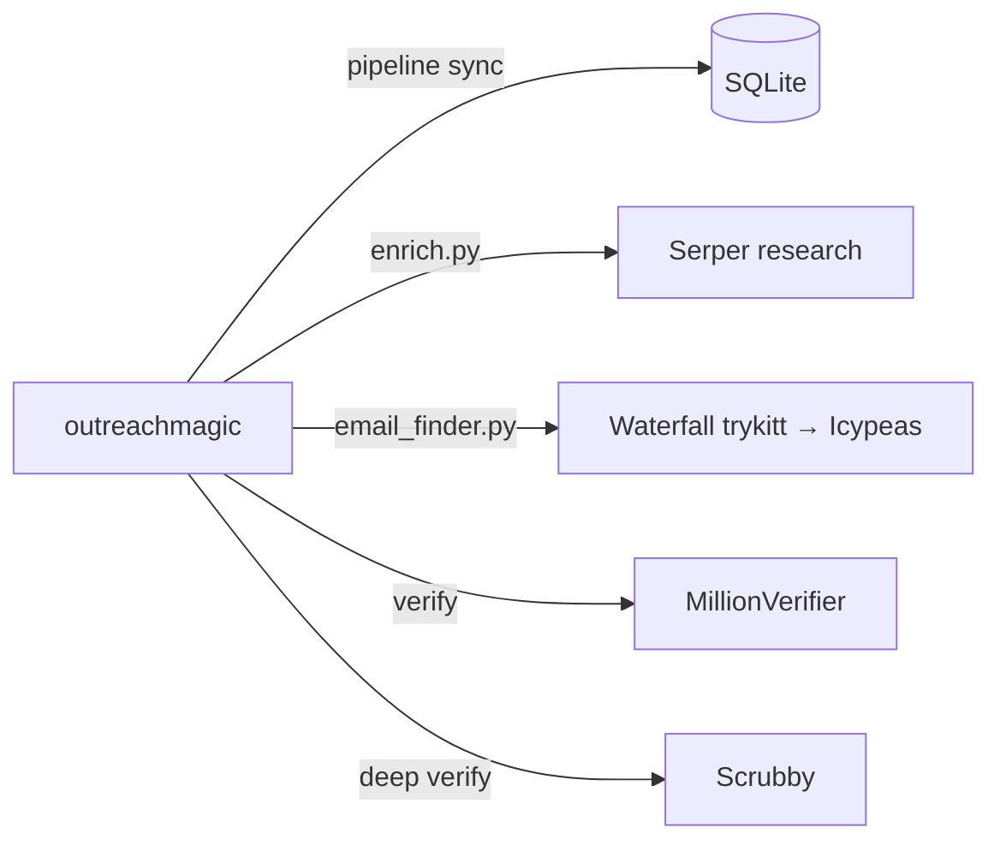

# Outreach Magic — consolidated skill

One skill, one install, one SKILL.md. **Pipeline sync, lead research via Serper, and email find/verify** — all in one local SQLite DB.

> Every other GTM skill tells your agent what to write. Outreach Magic tells your agent what's happening.

## Architecture



| Capability | Script | API Key |
|------------|--------|---------|
| **Pipeline sync** | `pipeline.py` | OM agent key |
| **Person research** | `enrich.py` | `SERPER_API_KEY` |
| **Email finding** | `email_finder.py` | `TRYKITT_API_KEY`, `ICYPEAS_API_KEY` |
| **Email verification** | `email_finder.py` | `MILLIONVERIFIER_API_KEY` |
| **Deep email verification** | `email_finder.py` | `SCRUBBY_API_KEY` |

## Machine config

Manifest paths, install pins, and install layout: [`skill-suite.json`](../skill-suite.json) at the repo root.
Regenerate manifests with `make manifests`; pre-tag gate: `make release-check`.

## Install

```bash
npx skills add outreachmagic/outreachmagic
```

See [AGENTS-INSTALL.md](../AGENTS-INSTALL.md) for the full agent install guide.

## Release docs

- [RELEASING.md](./RELEASING.md) — tags and CI
- [outreachmagic.io/pricing](https://outreachmagic.io/pricing) — pricing and plans
