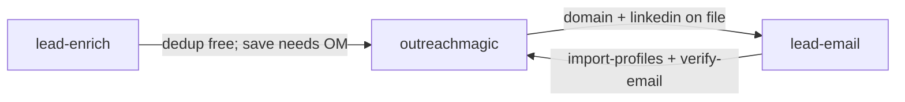

# Outreach Magic skill suite

Three intentional skills — not a 50-skill dump. **Outreach Magic is category 4: data infrastructure.** Strategy and copy skills stay stateless; OM is persistence.

> Every other GTM skill tells your agent what to write. Outreach Magic tells your agent what's happening.

## Funnel



| Skill | Role | Public repo | Release tag |
|-------|------|-------------|-------------|
| **outreachmagic** | Data layer — pipeline, relay, SQLite | `outreachmagic/hermes-outreachmagic` (+ cursor/claude) | `v*` |
| **lead-enrich** | Discovery — Serper, LinkedIn, domain | `outreachmagic/lead-enrich` | `lead-enrich-v*` |
| **lead-email** | Email find (trykitt v1) | `outreachmagic/lead-email` | `lead-email-v*` |

## Install order

1. **outreachmagic** — `pipeline.py init` then `pipeline.py login` in terminal  
2. **lead-enrich** — add `SERPER_API_KEY` to `~/.hermes/.env`  
3. **lead-email** (optional) — add `TRYKITT_API_KEY`; needs domain from enrich or CRM  

```bash
curl -fsSL https://raw.githubusercontent.com/outreachmagic/hermes-outreachmagic/main/platforms/hermes/install.sh | bash
# or locally:
bash platforms/hermes/install.sh --with-lead-enrich --with-lead-email
```

## Soft dependency

- **lead-enrich** and **lead-email** work without outreachmagic for JSON/API helpers, but **dedup + save require OM**.
- `check` / `batch-check` exit with a clear error if outreachmagic is missing — Serper paths still work when OM is installed elsewhere.

## Freemium

| Free forever (no relay count) | Counts as relay event |
|------------------------------|------------------------|
| Local pipeline queries | Webhook events synced from sequencers |
| `import-profiles`, export | |
| lead-enrich dedup (`check`) | |
| lead-email OM pre-check | |
| `verify-email` recording | |

Launch limits: **1,000 relay events/mo free**, **Pro $9/mo** (50k cap). See [positioning/pricing.md](./positioning/pricing.md).

## Naming: lead-email vs verify-email

- **`lead-email`** skill — finds emails (trykitt API).
- **`pipeline.py verify-email`** — records verification result in SQLite (no external API).

## related_skills (Hermes frontmatter)

- outreachmagic → `[lead-enrich, lead-email]`
- lead-enrich → `[outreachmagic, lead-email]`
- lead-email → `[outreachmagic, lead-enrich]`

## Release docs

- [RELEASING.md](./RELEASING.md) — tags and CI  
- [registry-publish.md](./registry-publish.md) — marketplace order  
